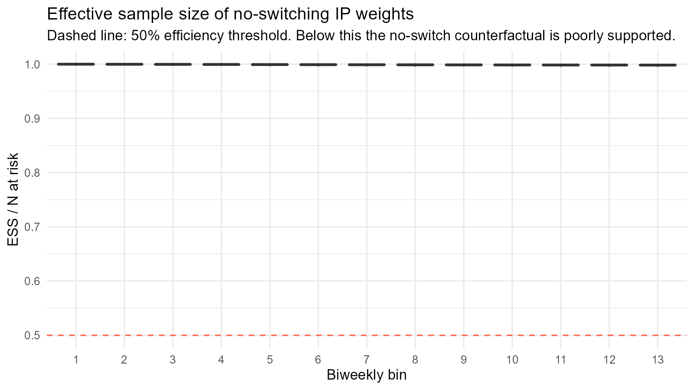

## Abstract

**Background.** The ICH E9(R1) addendum defines five strategies for handling intercurrent events. Each strategy defines a different causal quantity, and the estimator must target the quantity the scientific question requires. We use informative treatment switching as a worked example; the same alignment logic applies to informative loss to follow-up, informative monitoring, and competing risks.

**Methods.** A 200-iteration simulation study (N = 10,000) calibrated to the hepatitis B nephrotoxicity literature compared Cox-based methods (naive, censor-at-switch, IPCW) and longitudinal targeted maximum likelihood estimation (L-TMLE) across all five ICH E9(R1) intercurrent-event strategies, with seven sensitivity analyses covering Markov vs full-history nuisance modelling, informative censoring, direct time-varying IPCW vs L-TMLE on the same data, a calibrated stochastic intervention, a time-varying-confounder DGP at two calibrations, a proportional-hazards-satisfied DGP, and a ridge-augmented Super Learner library. Each estimator was judged on its native parameter (Cox on hazard ratios; L-TMLE on risk differences and risk ratios) against Monte Carlo truths from 500,000-subject counterfactual cohorts.

**Results.** L-TMLE achieved 93–96% RD coverage on four of five estimands (treatment-policy 94%, while-on-treatment 93%, composite 96%, oracle principal stratum 96%). The no-switch estimand reached 87% RD and RR coverage with upward bias (+0.050 RD, +0.155 RR) from the longitudinal nuisance-estimation burden of identifying a sustained-treatment intervention; an empirical-vs-EIF variance check confirms the bias, not standard-error miscalibration, drives the gap. Cox HR coverage of the true marginal HR was 8–14% on treatment-policy, no-switch, and while-on-treatment, 38% on composite, and 62% on the principal stratum (a structural coincidence under our switching strength). A diagnostic cross-check on while-on-treatment illustrates a common trap: a switch-as-censoring estimator targets the no-switch counterfactual under IPCW assumptions, while a competing-risks Monte Carlo truth is a different parameter; the apparent +0.036 bias is estimand-truth mismatch, and specifying the estimator on the cause-specific cumulative incidence recovers 93% coverage with bias −0.007.

**Conclusions and practical implications.** For applied time-to-event safety analyses with informative treatment switching, we recommend that analysts (i) specify the estimand before selecting the estimator, including the intercurrent-event strategy and population-level summary measure; (ii) report each estimator on its native scale (Cox on hazard ratios, targeted learning on risk-scale targets) without translating between them; (iii) use simpler estimators (IPTW-Kaplan-Meier, Aalen-Johansen with IPCW, single-time-point TMLE) where they suffice, reserving longitudinal-TMLE machinery for the hypothetical no-switch estimand; (iv) consider a calibrated stochastic intervention when deterministic-intervention positivity is poor; and (v) align Monte Carlo truths and estimators on the same population parameter when validating in simulation. The decision table and reporting checklist in §"Practical implications" operationalise these guidelines. The same alignment logic applies to other intercurrent events.

## Introduction

Post-marketing safety analyses routinely ask whether a drug increases the risk of an adverse event. When treatment switching occurs during follow-up, and when switching is driven by evolving clinical indicators that also affect the outcome, the answer depends on how switching is handled. The ICH E9(R1) addendum [@ich2019] formalises this dependence through the estimand framework, requiring that each analysis specify the population, treatment, outcome, intercurrent events, and the strategy used for each intercurrent event. Subsequent regulatory guidance has continued to develop this framework: the ICH M11 protocol template [@ich2023m11] makes estimand specification a required protocol section, the EMA reflection paper on principal stratum and other estimand strategies [@ema2020principal] addresses identification and reporting expectations, and the FDA guidance on real-world-evidence designs [@fda2023estimand] sets out sensitivity-analysis expectations for observational safety submissions. Recent methodological commentaries place the estimand framework explicitly within a causal-inference tradition that long pre-dates ICH E9(R1), notably the targeted-learning roadmap [@petersen2014; @dang2023; @gruber2022] and the principal-stratum literature [@bornkamp2021; @lipkovich2022].

Different strategies define different causal quantities. A treatment-policy strategy follows all patients from initiation regardless of switching; a hypothetical strategy models a world where switching does not occur; a while-on-treatment strategy restricts attention to the period before switching. Each question has clinical relevance, and each requires a compatible estimator.

In many applied analyses, the estimand is not explicitly defined; instead, it is implicitly determined by the estimator and data-handling decisions. For example, censoring follow-up at the time of treatment switching, while interpreting the result as a treatment-policy effect, silently substitutes the no-switch counterfactual under an inverse-probability-of-censoring weighting assumption for the intended treatment-policy estimand. Making the estimand explicit prevents this type of implicit mismatch.

In practice, analysts frequently apply Cox regression without verifying that the model's target (a conditional hazard ratio) corresponds to the intended estimand. This paper examines the consequences of that mismatch using a simulation study built around a hepatitis B safety scenario. We compare conventional Cox analyses to longitudinal targeted maximum likelihood estimation (L-TMLE), implemented within the longitudinal modified treatment policy framework, which directly targets marginal risk contrasts under specified interventions. The analysis concentrates on two estimands, treatment-policy and hypothetical no-switch, while reporting results for three additional strategies. It illustrates how the same data yield different estimates depending on the strategy chosen and on how well the estimator matches it.

We follow the causal roadmap for real-world evidence [@dang2023; @petersen2014], concentrating on estimand definition, identifiability assessment, and estimator selection. This paper follows that sequence: first defining the estimand, then stating the identifying assumptions, and only then evaluating estimators against the parameter each estimator is designed to target. The contribution of this paper is to show that estimator failure in these settings often reflects estimand-estimator mismatch rather than statistical inefficiency. This manuscript is intended both as a methodological simulation study and as a structured tutorial showing how estimand-estimator alignment can be implemented in practice. The simulation is a controlled demonstration showing how changing the estimand, while holding the observed-data structure largely fixed, changes both the target parameter and the interpretation of estimator performance. It does not attempt to compare all possible estimators across all plausible data-generating mechanisms. This ordering follows the target-trial framework, in which observational analyses are judged by how well they emulate the protocol of the hypothetical randomised trial that would answer the causal question of interest [@hernan_robins_2016].

The clinical motivation comes from the hepatitis B nephrotoxicity literature comparing tenofovir disoproxil fumarate (TDF) and entecavir (ETV). TDF can cause proximal tubular toxicity and decline in kidney function during long-term therapy. A systematic review reported that TDF was associated with greater increases in serum creatinine and reductions in estimated glomerular filtration rate during the first 6-24 months of therapy relative to ETV, although the effect was generally modest [@lee2019]. Real-world cohort studies report a higher risk of kidney function decline among TDF patients during early follow-up, particularly among individuals with baseline renal risk factors [@jung2022; @mak2022]. These findings suggest a pattern of modestly elevated early renal risk that attenuates over longer follow-up. The simulation incorporates a non-proportional treatment effect structure reflecting this empirical pattern: an early hazard ratio above one and a later hazard ratio closer to the null.

<!-- Note: severe kidney outcomes (kidney failure, RRT) are rarer than milder
     measures (eGFR decline, CKD progression, serum creatinine, AKI). The
     literature does not support a later protective effect of TDF. -->

### Causal Model and Identification

Let $A \in \{0,1\}$ denote baseline treatment arm, $\bar{S} = (S_1, \ldots, S_K)$ the longitudinal switching process (an intercurrent event that follows baseline assignment), $\bar{L} = (L_0, L_1, \ldots, L_K)$ the time-varying covariate history including baseline confounders $L_0$, and $Y(\tau)$ the 180-day event indicator. Treatment $A$ and the intercurrent-event process $\bar{S}$ are kept separate: $A$ identifies the baseline arm a patient was randomised or assigned to, and $\bar{S}$ is the post-baseline switching trajectory.

For a given intervention $g$ on the switching process $\bar{S}$ (e.g., $g \equiv 0$ for "no patient switches," or $g$ = the natural course observed under arm $A=a$), the **causal estimand** is a contrast of counterfactual risks across baseline arms: the counterfactual risk difference $\psi^{RD}_g = E[Y^{A=1,\,g}(\tau)] - E[Y^{A=0,\,g}(\tau)]$ and risk ratio $\psi^{RR}_g = E[Y^{A=1,\,g}(\tau)] / E[Y^{A=0,\,g}(\tau)]$. Different ICH E9(R1) strategies correspond to different choices of $g$ (and, for principal stratum and competing-risks while-on-treatment, to different choices of the conditioning set or outcome definition).

The **statistical estimand** is the corresponding functional of the observed-data distribution that equals the causal estimand under the following identification assumptions:

- **Consistency:** $Y = Y^{A,\,\bar{S}}$ for the observed $(A, \bar{S})$.
- **Sequential exchangeability:** $Y^{A=a,\,g} \perp A \mid L_0$ at baseline, and at each time $k$, $Y^{A=a,\,g} \perp S_k \mid \bar{L}_k, \bar{S}_{k-1}, A$ (no unmeasured confounders of the switching decision at each step).
- **Positivity (baseline):** $0 < \Pr(A = a \mid L_0) < 1$ for $a \in \{0,1\}$.
- **Sequential positivity for the switching intervention:** at each $k$, the intervention's distribution on $S_k$ has support within the observed conditional distribution of $S_k$ given $(\bar{L}_k, \bar{S}_{k-1}, A)$. For the deterministic no-switch regime ($g \equiv 0$), this reduces to $\Pr(S_k = 0 \mid \bar{L}_k, \bar{S}_{k-1} = 0, A) > 0$ for the histories the intervention requires. When high-risk patients switch almost deterministically, this condition fails or becomes practically weak.

A note on the implementation. In the `lmtp` package, the static no-switch intervention is implemented by treating *current treatment* as a time-varying node $A_j$ (taking the baseline arm before switch and the opposite arm after) and overriding all $A_j$ to the baseline value. This implementation is mathematically equivalent to a deterministic intervention on $\bar{S}$ that sets $S_k = 0$ at every $k$, but the bookkeeping is slightly different. We retain the $(A, \bar{S})$ separation in the conceptual model because it makes the estimand definitions clearer; the time-varying-treatment encoding is described in each estimand's *L-TMLE implementation* paragraph.

### Three failure modes

The mismatches we examine fall into three distinct failure modes: (i) **wrong estimand**, where the analysis answers a different scientific question than intended; (ii) **right estimand, wrong estimator**, where the method does not target the stated quantity; and (iii) **right estimand and estimator, insufficient support**, where the data lack positivity for the target intervention. Each has a different remedy, and conflating them obscures which is at fault.

### Positioning within the causal roadmap

The causal roadmap separates three tasks that are often conflated in applied time-to-event analyses [@petersen2014]: first, translate the scientific question into a causal estimand (including the strategy for each intercurrent event); second, state the assumptions required to identify that estimand from observed data (consistency, exchangeability, positivity); third, select an estimator targeted to the resulting statistical parameter. Many conventional time-to-event analyses begin at the third step, selecting Cox regression and only implicitly defining the estimand afterward. Our simulation reverses that order so the consequences of estimator-before-estimand reasoning become visible.

### Cox hazard ratios as causal estimands

The Cox hazard ratio is not, in general, the marginal causal estimand targeted by treatment-policy, hypothetical, or while-on-treatment risk questions. It is a conditional survival-function summary whose interpretation can drift over time as events accrue, because the risk sets being compared at later $t$ are the depleted subsets who have already survived earlier risk rather than the randomised groups [@hernan2010_hazards; @martinussen2022; @stensrud2019]. Under non-proportional hazards, the Cox estimate is additionally a weighted average of time-varying log-HRs whose weights depend on the censoring distribution, and so need not match the clinically intended estimand [@rufibach2019]. Risk-scale contrasts (RD, RR) avoid these difficulties.

## Practical implications

The recommendations that follow are the practical takeaways from the simulation evidence presented in the rest of the paper. We preview them here so that applied analysts can use them as a decision aid, with the methodological evidence behind each recommendation deferred to the Results, Discussion, and Supplementary Methods. The five-row decision table operationalises estimand choice; the seven-item reporting checklist operationalises what to put into the analysis report.

### Three failure modes to diagnose your own analysis

Before picking up the decision table, an applied analyst should diagnose which of three failure modes their current analysis is most at risk of. Each has a different remedy, and conflating them obscures which is at fault:

1. **Wrong estimand.** The analysis answers a different scientific question than intended. Example: censoring follow-up at the time of treatment switching while interpreting the result as a treatment-policy effect silently substitutes the no-switch counterfactual (under inverse-probability-of-censoring assumptions) for the intended treatment-policy estimand. Remedy: state the estimand explicitly using the five ICH E9(R1) attributes, then verify that the estimator targets that estimand on its native scale.
2. **Right estimand, wrong estimator.** The method does not target the stated quantity. Example: reporting a Cox hazard ratio as if it were a marginal risk contrast, when the hazard ratio is a conditional survival-function summary that can drift over time and is non-collapsible to the marginal scale. Remedy: pair each estimand with an estimator that natively targets it on the correct scale (see the decision table and Estimation Strategies).
3. **Right estimand, right estimator, insufficient empirical support.** The data lack positivity for the target intervention. Example: a no-switch deterministic intervention on a cohort in which high-risk patients switch almost deterministically. Remedy: either step down to a less demanding estimand from the decision table, or use a calibrated stochastic intervention that does not require deterministic positivity (see §"Supplementary Methods: Stochastic-intervention arm").

The decision table and the reporting checklist below assume the analyst has already passed the first test (estimand specified) and is choosing among well-aligned estimators. The Supplementary Methods document the sensitivities that diagnose the third failure mode under our DGP.

### Decision table: choosing an intercurrent-event strategy

|Estimand                             |Use when                                                                                                              |Caveat                                                                                                                                                                                                                                                                                                                                                                                                   |
|:------------------------------------|:---------------------------------------------------------------------------------------------------------------------|:--------------------------------------------------------------------------------------------------------------------------------------------------------------------------------------------------------------------------------------------------------------------------------------------------------------------------------------------------------------------------------------------------------|
|Treatment-policy                     |Default for routine safety analysis; reflects observed prescribing practice; only needs baseline-treatment positivity |Real-world effect including downstream switching, not the pure pharmacological signal                                                                                                                                                                                                                                                                                                                    |
|While-on-treatment (competing-risks) |You want a descriptive cause-specific 180-day risk under the assigned drug; same positivity as TP                     |Switching halts outcome ascertainment; descriptive quantity, not a counterfactual under sustained treatment                                                                                                                                                                                                                                                                                              |
|Composite                            |Want to sidestep switching positivity and a single combined endpoint is clinically meaningful                         |Switching itself counts as an event; inflates the effect (RR 1.46 vs 1.25 for TP) and conflates tolerability with safety                                                                                                                                                                                                                                                                                 |
|Principal stratum                    |Natural fit for adherence-adjusted, mediation-flavoured, or label-restriction questions                               |Effect defined on the latent never-switcher subset (~19% of cohort), not the full population; needs cross-world or monotonicity assumptions. The observable-non-switcher approximation performs poorly (50% RD coverage in our simulation) because observed non-switchers are post-treatment selected; a principal-score-weighted L-TMLE under principal ignorability is the natural applied alternative |
|No-switch (hypothetical)             |Pure pharmacological effect under sustained exposure required and switching is rare or well-modelled                  |Most demanding longitudinal nuisance estimation; coverage drops to 87% even at 11% switching. When switching exceeds ~40–50% in key subgroups, consider a calibrated stochastic intervention or step down to treatment-policy or competing-risks while-on-treatment                                                                                                                                      |

### Reporting checklist for an estimand-aligned safety analysis

1. **Estimand attributes (ICH E9(R1) and M11):** population, treatment, outcome, intercurrent events, strategy per intercurrent event, time horizon, and population-level summary measure. State each attribute explicitly, even when unchanged from a prior analysis.
2. **Identifying assumptions per intercurrent-event strategy:** which positivity, exchangeability, and (for principal stratum) cross-world or monotonicity assumptions identify the chosen estimand from the observed data. State the assumptions in the language of the estimand the analysis targets, not in generic causal terms.
3. **Positivity diagnostics:** propensity-score and switching-probability distributions by treatment arm and key covariate strata; effective sample size after weighting; treatment-by-confounder cells with no observed switching.
4. **Estimator-to-estimand alignment:** which estimator is targeting which estimand, and on what scale (HR, RD, RR). When the same dataset supports multiple estimands, pair each estimand with the most aligned estimator and report all pairings as a matrix.
5. **Native-scale reporting only:** if the analysis reports a Cox hazard ratio, report it as a hazard ratio and do not translate it into a risk-difference-flavoured statement. If the analysis reports a marginal risk difference, use a risk-scale estimator (IPTW-Kaplan-Meier, AIPW, targeted learning, Aalen-Johansen with IPCW) rather than a Cox-derived standardisation.
6. **Sensitivity to unmeasured confounding:** at minimum an E-value or G-value paired with at least one falsification analysis (negative-control outcome or exposure).
7. **Sensitivity to estimand choice:** report the headline estimand alongside at least one neighbour from the decision table (typically treatment-policy alongside the chosen target), so readers can see how much the conclusion depends on the strategy chosen.

### Caveats that change applied practice

Two finite-sample caveats from the sensitivity analyses are important for practitioners and are not visible in the decision-table headlines.

- **L-TMLE bias grows with conditional effect size at tutorial-scale learner libraries.** In the main simulation (HR_early = 2.0 attenuating to HR_late = 0.90, which is closer to most real safety profiles in which strong early effects attenuate over follow-up) L-TMLE achieves 87–96% coverage across the five estimands. In a proportional-hazards-satisfied sensitivity in which the conditional treatment effect is HR = 2.0 throughout follow-up, a stress-test case in which the conditional effect is sustained at its early peak rather than attenuating, L-TMLE risk-difference bias grows substantially (treatment-policy bias +0.058 vs +0.004 in the main DGP; no-switch bias +0.091 vs +0.050; while-on-treatment bias +0.027 vs −0.007) and coverage drops correspondingly (treatment-policy 8%, no-switch 67%, while-on-treatment 42%, composite 92%). The confidence-interval widths remain calibrated; the point estimate carries a systematic bias that scales with the magnitude of the underlying conditional effect. Applied analyses with strong sustained expected effects (HR > ~1.5 throughout the time horizon, rather than attenuating from a peak) should budget for either richer Super Learner libraries or larger sample sizes; the tutorial-scale library used in this paper is not sufficient at strong sustained effects (§"Supplementary Methods: Proportional-hazards-satisfied sensitivity").

- **The no-switch estimand carries a small positive bias that we cannot fully localise.** Across the main simulation and six sensitivity analyses (Markov vs full-history nuisance modelling, informative vs random administrative censoring, production-quality time-varying IPCW Cox on the same observed data, time-varying-confounder DGP with two calibrations, ridge-regularised Super Learner, proportional-hazards-satisfied DGP), L-TMLE no-switch RD coverage stays in the 67–93% range and never reaches the nominal 95%. The bias is not driven by informative censoring, long-history overfitting, weight instability, missing time-varying confounder adjustment, or linear-multicollinearity-induced variance in the nuisance estimation. A direct empirical-versus-EIF variance comparison on the main simulation confirms that the confidence-interval widths are correctly sized (empirical SD 0.062 vs mean EIF SE 0.060); the gap from nominal is driven by a small positive bias in the point estimate, not by underestimated standard errors. For applied analyses targeting the no-switch estimand at small to moderate sample sizes, expect approximately 10% under-coverage and a small positive bias, both of which would be reduced by richer nuisance learners or larger samples.

### Reading guide for the rest of the paper

The Motivating Setting and Simulation Design sections give the data-generating mechanism that motivates the decision table. The Estimand Framework and Estimation Strategies sections define each estimand and its aligned estimator. The Simulation Results quantify performance under repeated sampling. The Discussion synthesises the recommendations in context, and the Supplementary Methods document the sensitivity analyses (Markov vs full-history nuisance modelling, informative censoring, direct IPCW vs L-TMLE, stochastic intervention, time-varying-confounder DGP, proportional-hazards-satisfied DGP) that triangulate the decisions. Readers who want only the applied takeaway can stop after this section, returning to §"Discussion: Data support and estimand feasibility" for the support-diagnostic perspective; readers interested in the methodology will find it in the Simulation Design and Estimation Strategies sections and the Supplementary Methods.

## Motivating Setting

The simulation draws on concerns about nephrotoxicity in tenofovir-containing hepatitis B regimens relative to entecavir-based alternatives. Tenofovir disoproxil fumarate (TDF) can cause proximal tubular toxicity through a mitochondriopathy of the renal proximal tubules [@perazella2010; @kohler2009]; entecavir (ETV) is not similarly nephrotoxic [@izzedine2005]. In routine clinical practice, treatment assignment is confounded by baseline renal and hepatic risk factors: patients with pre-existing chronic kidney disease (CKD), cirrhosis, or older age may be selectively assigned to one regimen or the other based on perceived vulnerability.

The primary intercurrent event in this setting is informative treatment switching. In clinical practice, switching is driven by evolving renal signals (rising serum creatinine, declining eGFR) that prompt physicians to switch patients off TDF to preserve kidney function. The same baseline risk factors that raise the long-run risk of renal failure (most notably pre-existing CKD) also raise the probability of being switched, so the switched population is systematically higher-risk than the population that remains on the assigned regimen. Any analysis that censors at the switch time, adjusts for switching as a time-varying covariate, or reweights on the switching probability must therefore confront the fact that switching carries information about the outcome.

The simulated cohort encodes a simplified version of this structure: (i) baseline confounding of treatment assignment by CKD, cirrhosis, age, and related risk factors; (ii) a non-proportional treatment effect on renal failure with early harm and late attenuation; and (iii) informative switching driven by the assigned treatment and *baseline* CKD. The simulation uses baseline CKD as a tractable proxy for the time-varying renal marker that would drive switching in practice. This simplification keeps the data-generating process analytically transparent and permits closed-form Monte Carlo truth values for each ICH E9(R1) estimand, at the cost of suppressing one biological mechanism (within-patient evolution of renal function). We flag a time-varying marker DGP as a natural extension in Limitations.

## Simulation Design

### Data-generating process

The simulation produces cohorts with confounded treatment assignment, a piecewise-exponential event process with non-proportional hazards (HR = 2.0 before day 90, HR = 0.90 after), and informative switching driven by the assigned treatment and *baseline* CKD (the simplified proxy for the time-varying renal marker described in Motivating Setting). The early hazard ratio of 2.0 is large by design, chosen to make the contrasts between estimands and estimators clearly visible. The attenuation to HR = 0.90 after day 90 creates a non-proportional structure consistent with the hepatitis B nephrotoxicity literature. The baseline hazard is calibrated to produce an approximately 16% 180-day event rate. Switching rates are moderate (about 11% overall, 21% among TDF-treated CKD patients), which produces a 2 percentage-point divergence between treatment-policy and no-switch estimands while leaving approximately 19% of subjects as never-switchers to support principal stratum analyses. When a patient switches, the post-switch event hazard changes to reflect the new treatment. Administrative censoring is informative in the simulation: the censoring hazard depends on baseline outcome covariates.

In compact form, for subject $i$ with baseline covariates $X_i$ and treatment $A_i \in \{0, 1\}$:

- **Event hazard**: $\lambda_i^{Y}(t) = \lambda_0(t) \cdot \exp\bigl(\beta_X^{\top} X_i + \beta_A(t) A_i^{\text{cur}}(t)\bigr)$, where $A_i^{\text{cur}}(t)$ is the current treatment (which equals $A_i$ before the switch and $1 - A_i$ after), $\lambda_0(t)$ is the baseline hazard, and $\beta_A(t) = \log(2.0)$ for $t < 90$ and $\log(0.90)$ for $t \geq 90$.
- **Switch hazard**: $\lambda_i^{S}(t) = \lambda_0^{S} \cdot \exp(\gamma_A A_i + \gamma_{\text{CKD}} \, \text{CKD}_i)$ with $\gamma_A = 0.80$ and $\gamma_{\text{CKD}} = 0.60$. The switch hazard depends only on the *baseline* CKD indicator and the baseline arm; the only time-dependence enters through $\lambda_0^S$.

*A clarification on the time structure of confounding.* The DGP contains no time-varying covariate $L(t)$; what is time-varying is the switching trajectory $\bar{S}$ itself, which depends on baseline confounders and on the baseline arm. The bias confronting any switching-adjustment estimator therefore arises from *post-treatment selection* on a time-varying intercurrent-event process driven by baseline confounders, not from classical Robins-style time-dependent confounding in the $L(t) \to A(t)$ sense. Baseline adjustment for CKD suffices for the confounding structure encoded here; the analytic difficulty for the no-switch L-TMLE estimator (responsible for its 87% coverage in the main results) is the longitudinal nuisance-product structure of the identifying functional, not an unrecovered time-varying confounder. A supplementary sensitivity explores a parallel DGP in which a latent renal-function-like marker $L(t)$ evolves over biweekly bins and drives switching and the outcome at two calibrations: one with no treatment-confounder feedback (pure exogenous $L(t)$) and one with full $A(t{-}1) \to L(t)$ feedback (the canonical Robins setting). Across 200 iterations at $N = 3{,}000$, L-TMLE with baseline-covariate adjustment recovered the no-switch estimand with bias $-0.001$ (Monte Carlo SE 0.008) and coverage 90% under feedback, and with bias $+0.003$ (MC SE 0.007) and coverage 92% under the exogenous calibration. Adding the time-varying marker $L(t)$ to the adjustment set produced statistically indistinguishable results in both calibrations (feedback bias $+0.012$, MC SE 0.008, coverage 91%; exogenous bias $+0.004$, MC SE 0.007, coverage 91%), confirming that the additional time-varying adjustment was informationally redundant in this parameterisation. This paper therefore does not claim to demonstrate L-TMLE's handling of irreducible treatment-confounder feedback; the longitudinal estimator earns its place in the primary analysis through the longitudinal no-switch intervention and the time-varying censoring process, not through a time-varying confounder that the primary DGP does not contain. The full results, including the structural explanation for why baseline adjustment suffices under feedback, are in §"Supplementary Methods: Time-varying-confounder DGP sensitivity".
- **Administrative censoring**: the censoring hazard is a function of baseline outcome covariates so that informative loss to follow-up is present in addition to switching.
- **Treatment assignment**: $\Pr(A_i = 1 \mid X_i)$ is a logistic function of CKD, cirrhosis, age, and related risk factors, calibrated to the target marginal prevalence.

A complete specification, including baseline covariate distributions and parameter values, is in `DGP.R`; the full DGP parameter list is tabulated in §"Supplementary Methods: DGP parameter specification".

A single observed-data dataset, generated under the natural-course regime where switching occurs and modifies the post-switch hazard but does not censor follow-up, supports all five *estimator* analyses. The raw event, switching, and censoring times are retained, and each estimand redefines its follow-up time and event indicator from these primitives. All five estimators are fit to this single observed dataset; what differs across estimands is the *target parameter* and the *L-TMLE specification*, not the input data.

The no-switch *truth* (used only to validate the no-switch estimator) is computed from a separately generated counterfactual cohort in which switching is suppressed entirely; this is a Monte Carlo evaluation of the population parameter that the no-switch intervention targets, not a second observed dataset.

Table: Simulated cohort characteristics

|Quantity                     |Value  |
|:----------------------------|:------|
|Sample size                  |10,000 |
|180-day event rate           |0.177  |
|Switching rate               |0.109  |
|Switching rate (active, CKD) |0.171  |
|Switching rate (comparator)  |0.084  |
|Median follow-up (days)      |58     |

The DAG in Figure 1 makes the source of informative switching explicit: baseline factors affect treatment, switching, censoring, and renal failure.

Assumed causal structure. Baseline confounders (W) affect treatment assignment, switching, censoring, and renal failure. Switching modifies the post-switch hazard for renal failure.

### Known truth

Because the DGP is fully specified, true marginal risks can be computed by generating large counterfactual datasets (N = 500,000 per arm) under each policy, with no dependent censoring.

|Strategy               | Risk (active)| Risk (comparator)| Risk difference| Risk ratio| Marginal HR|
|:----------------------|-------------:|-----------------:|---------------:|----------:|-----------:|
|Treatment-policy       |        0.3538|            0.2827|          0.0711|     1.2514|      1.3617|
|Hypothetical no-switch |        0.3613|            0.2701|          0.0912|     1.3376|      1.4753|
|While-on-treatment     |        0.3106|            0.2466|          0.0640|     1.2594|      1.5122|
|Composite              |        0.5780|            0.3948|          0.1832|     1.4640|      1.7730|
|Principal stratum      |        0.3490|            0.2593|          0.0897|     1.3458|      1.4778|

The treatment-policy risk difference is positive: TDF causes early harm (HR = 2.0 before day 90), and although the ~11% of patients who switch from TDF to ETV escape the late-period elevated hazard, the accumulated early risk in the remainder of TDF-treated patients is not fully offset. Under the no-switch strategy, where patients remain on their assigned treatment for the full 180 days, the risk difference reflects the full non-proportional hazard structure (HR = 2.0 early, HR = 0.90 late). Because the late-period hazard ratio falls below 1, sustained treatment without switching partially offsets the early harm, but the net effect remains positive. The no-switch risk difference (+9.1 pp) exceeds the treatment-policy difference (+7.1 pp) by 2 percentage points, reflecting the risk that switchers avoid by leaving TDF. The composite strategy produces the largest risk difference because TDF-treated patients experience substantially more switching, and switching itself counts as an event.

The while-on-treatment truth differs from the no-switch truth because follow-up is truncated at switching. Subjects who switch before 180 days contribute only their pre-switch person-time; the 180-day risk is computed under this truncation rule, not as a conditional risk among non-switchers. The principal stratum further restricts to the latent subpopulation who would not switch under *either* treatment assignment.

### Divergence of treatment-policy and no-switch estimands

Under the simulation DGP the treatment-policy and no-switch risk differences differ by 2 percentage points (+7.1% vs +9.1%), driven by the ~11% of TDF-treated patients who switch and so escape the residual late-period hazard. The divergence grows with switching intensity: a sensitivity DGP at ~31% switching widened the gap to 6.5 percentage points (+2.6% vs +9.1%). In oncology crossover trials with 30-40% unidirectional crossover and large post-switch hazard changes, the two estimands diverge more dramatically still: treatment-policy is sharply attenuated because control-arm patients cross over to the active drug, while no-switch preserves the full effect. The choice of estimand therefore materially shapes the reported treatment effect whenever switching is common, and progressively more so as switching becomes more prevalent.

Treatment crossover in oncology is the canonical example. Patients randomised to control are allowed to cross over to the experimental treatment after disease progression. Under the treatment-policy estimand, patients are followed as randomised regardless of crossover; under the no-switch (hypothetical) estimand, the analysis asks what the survival difference would have been if no crossover had occurred. The treatment-policy estimand is attenuated by control-arm uptake of the active drug when the drug is effective, but it captures the real-world consequences of prescribing under routine practice; the no-switch estimand reflects the policy-relevant comparison of a world where the drug is available versus one where it is not, and is often the quantity most relevant for drug-approval decisions [@latimer2014; @latimer2015].

Several statistical methods have been developed to recover the no-switch estimand from crossover-contaminated oncology data, including rank-preserving structural failure time models (RPSFTM), inverse probability of censoring weighting (IPCW), and two-stage estimation [@latimer2014]. They share the goal of adjusting for the post-randomisation treatment change but differ in their identifying assumptions: RPSFTM assumes a common treatment effect for every patient exposed to the experimental drug; IPCW assumes no unmeasured confounders of the crossover decision at every time point; and two-stage estimation invokes a weaker no-unmeasured-confounding assumption by exploiting a clinically meaningful secondary baseline such as disease progression. The L-TMLE approach used in this paper sits in the doubly robust tradition that models both the treatment/switching process and the outcome, and is complementary to these methods rather than a replacement for them.

The hepatitis B safety setting studied here differs from oncology crossover in two respects. First, switching is from the active (potentially harmful) drug to the comparator, not from control to experimental. Second, switching rates are moderate (~11%) and the post-switch hazard change is modest, so the treatment-policy and no-switch truths differ by 2 percentage points rather than the much larger gaps typical of oncology crossover trials. Even in this more modest setting, the choice between estimands produces meaningfully different clinical conclusions.

## Estimand Framework

An estimand is a precise specification of the population-level quantity an analysis aims to estimate. Under ICH E9(R1), an estimand is defined by five attributes: the **population**, the **treatment** under comparison, the **outcome** (variable and time horizon), any **intercurrent events**, and the **strategy** used to handle each intercurrent event [@ich2019]. The estimand should be distinguished from the estimator (the statistical procedure used to approximate the estimand from observed data) and the estimate (the realised value obtained from applying the estimator to a given dataset); much of the confusion in applied analyses arises from conflating these three concepts. The five strategies tabulated below (treatment-policy, hypothetical, while-on-treatment, composite, and principal stratum) vary only the last attribute. In this paper the population (hepatitis B patients initiating therapy), treatment (TDF vs ETV), outcome (renal failure within 180 days), and intercurrent event (treatment switching) are held fixed; only the handling strategy varies. Readers should not interpret the five strategies as the full definition of an estimand: a different population or time horizon would yield a different estimand even under the same handling strategy.

Intercurrent-event handling is therefore the experimental dimension of this simulation, not the full estimand: the other estimand attributes (population, treatment definition, outcome definition, time horizon, summary measure) are held fixed so the consequences of changing the handling strategy can be studied cleanly. We define each of the five strategies below, specifying for each the counterfactual intervention, how the truth is computed in the simulation, and how L-TMLE and Cox implement the corresponding estimator. The treatment-policy and hypothetical no-switch strategies receive the closest analytical attention because they illustrate the estimand-estimator mismatch most directly; while-on-treatment, composite, and principal stratum follow.

### Treatment-policy

*Target trial:* Randomise patients to active or comparator at baseline. Follow all patients for 180 days regardless of any treatment changes. If a patient switches regimens, continue following them: the switch and its consequences are part of what happens under the assigned strategy.

*Counterfactual:* $Y^{A=a,\,g_{\text{nat}}}(180)$ is the renal-failure indicator under baseline assignment $a$ with switching following its natural course ($g_{\text{nat}}$ = no intervention on $\bar{S}$). The target is $\psi^{TP} = E[Y^{A=1,\,g_{\text{nat}}}(180)] - E[Y^{A=0,\,g_{\text{nat}}}(180)]$.

*Truth:* Generate 500,000 all-treated and all-control subjects with switching enabled. Post-switch hazards change to reflect the new treatment. Follow-up is not censored at switch. Compute 180-day cumulative incidence in each arm.

*L-TMLE implementation:* Treatment is modelled as a single baseline node. The intervention sets $A = 1$ or $A = 0$ at baseline and leaves the post-baseline switching process at its natural course. The L-TMLE censoring nodes encode loss to follow-up, which is informative because the censoring hazard depends on baseline outcome covariates; the censoring model adjusts for this dependence. No intervention is applied to switching.

*Cox implementation:* Cox naive on full follow-up, with baseline covariates as adjustment variables and no special handling of switching. This is what a practitioner most plausibly fits when treatment policy is the intended estimand.

### Hypothetical no-switch

*Target trial:* Randomise patients to active or comparator at baseline. Prevent any patient from switching for the entire 180-day follow-up. This is a hypothetical intervention on the post-baseline treatment process.

*Counterfactual:* $Y^{A=a,\,g\equiv 0}(180)$ is the renal-failure indicator under baseline assignment $a$ and the intervention $g\equiv 0$ that sets every $S_k$ to zero. The target is $\psi^{HYP} = E[Y^{A=1,\,g\equiv 0}(180)] - E[Y^{A=0,\,g\equiv 0}(180)]$.

*Truth:* Generate 500,000 all-treated and all-control subjects with switching suppressed entirely. Event times are drawn under sustained assigned treatment.

*L-TMLE implementation:* Conceptually the intervention is on the switching process $\bar{S}$, setting $S_k = 0$ at every $k$ while leaving the baseline arm $A=a$ unchanged. In practice this is encoded by treating *current treatment* as a sequence of time-varying nodes $A_1, \ldots, A_{13}$ (the observed treatment at biweekly bin $j$, equal to the baseline arm before switch and the opposite arm after) and overriding every $A_j$ to the baseline value $a$. The two encodings are equivalent: forcing $S_k = 0$ is the same as forcing $A_j = a$ at every bin. Identification requires (i) exchangeability of baseline arm given baseline confounders and (ii) sequential exchangeability of the switching decision at each time point given the history $(\bar L_k, \bar S_{k-1}, A)$.

*Cox implementation:* Cox IPCW with weights derived from a model for the probability of remaining unswitched given measured covariates. This is the conventional Cox-based route to the no-switching counterfactual. In our simulation it is fit on a counterfactual cohort in which switching is suppressed; see §"No-switch" in Results and Limitations §"Cox-L-TMLE input asymmetry" for the implications.

### While-on-treatment

*Target trial:* Randomise patients to active or comparator. Define the outcome as renal failure that occurs before any treatment switch, within the 180-day window. Switching is a *competing event* that prevents the outcome from being attributable to the assigned treatment: once a patient switches, no further renal failure on the assigned drug can be ascertained for that patient.

*Counterfactual:* The target is the 180-day cause-specific cumulative incidence of renal failure occurring before switching, with the baseline arm set to $a$ and the switching process left at its natural course ($g_{\text{nat}}$). Formally, $\psi^{WOT} = E\bigl[I(T_{event}^{A=1,\,g_{\text{nat}}} \leq \min(T_{switch}^{A=1,\,g_{\text{nat}}}, 180))\bigr] - E\bigl[I(T_{event}^{A=0,\,g_{\text{nat}}} \leq \min(T_{switch}^{A=0,\,g_{\text{nat}}}, 180))\bigr]$.

*Truth:* Generate 500,000 all-treated and all-control subjects with switching enabled. The 180-day risk is computed directly as the proportion of subjects whose event occurs before both their switch time and 180 days. Under counterfactual uniform treatment with no dependent administrative censoring, this Monte Carlo average is the exact cause-specific cumulative incidence.

*L-TMLE implementation:* Treatment is modelled as baseline-only. Switching is absorbed into the outcome definition rather than the censoring nodes: the per-bin outcome indicator records an event only if it occurred before any switch, and subjects who switch without a prior event remain in the risk set with the outcome locked at 0 at every subsequent bin. The censoring nodes encode only administrative censoring that occurs before any switch. This setup makes the L-TMLE estimator target the cause-specific cumulative incidence function, defined as $P(T \leq t,\, \text{event before switching})$, rather than the survival function under a hypothetical no-switch intervention. Identification requires only sequential exchangeability of baseline treatment given confounders, the same condition as treatment-policy. No IPCW-style assumption on switching is required. The alternative interpretation, and our reasons for choosing this one, are described below.

*Cox implementation:* Cox censor-at-switch, the conventional discontinuation-time analysis. Note that this targets the IPCW interpretation of while-on-treatment (the no-switching counterfactual under non-informative-censoring assumptions), not the competing-risks interpretation we adopt as our truth; this estimand-implementation mismatch is the basis of the diagnostic in §"Diagnosing the while-on-treatment estimand-truth mismatch".

#### Two interpretations of "while on treatment"

The ICH E9(R1) addendum lists while-on-treatment as a distinct strategy, but the literature uses the term in two different ways. One reading treats switching as censoring and targets the no-switch counterfactual under an IPCW-type assumption [@latimer2014; @latimer2015; @akacha2017]. The other treats switching as a competing event and targets the observable probability that renal failure occurs before switching [@rufibach2019; @andersen2003]. These are different population parameters. One describes what actually happens before discontinuation; the other describes what would have happened if discontinuation never occurred. Numerical disagreement between analyses labelled "while on treatment" may therefore reflect a difference in estimand, not a difference in estimator performance.

The first tradition is exemplified by Latimer's work on switching adjustments in oncology trials [@latimer2014; @latimer2015]. It treats while-on-treatment as a *counterfactual* estimand identified through inverse-probability-of-censoring weighting that censors at the switching event. Under this reading, while-on-treatment and the hypothetical no-switch estimand target the same population parameter, the cumulative incidence of the outcome under continuous assigned treatment, and they differ only in the identification path. When the IPCW non-informative-censoring assumption holds, the two estimators converge to the same value. In our simulation, an IPCW-style switch-censoring estimator targets a quantity that is numerically very close to the no-switch hypothetical truth (+0.090 vs +0.091). The residual gap reflects the small bias introduced by the untestable assumption that switching is conditionally independent of the outcome given measured covariates.

The second tradition is exemplified by Rufibach's framing for regulatory time-to-event settings [@rufibach2019] and is aligned with the broader competing-risks literature [@dignam2012_competing]. It interprets while-on-treatment as a *descriptive cause-specific cumulative incidence*: the observable joint probability that the outcome occurs before the intercurrent event. Switching is a competing event rather than a censoring mechanism, and the estimand is a function of the observed joint distribution, not a counterfactual under an unobserved no-switching world. Under our simulation, this descriptive while-on-treatment estimand is +0.064 RD, 2.7 percentage points smaller than the no-switch quantity. The gap is the entire substantive difference between the two interpretations, and it grows with the strength of informative switching.

We adopt the descriptive (competing-risks) interpretation in this paper for three reasons.

First, identifiability without strong cross-arm assumptions. The competing-risks version requires only sequential exchangeability of baseline treatment given measured confounders, plus adjustment for any administrative censoring before the switch. These are the same conditions that identify the treatment-policy estimand. The IPCW version additionally requires non-informative switch-censoring conditional on measured covariates. That assumption is empirically untestable and is precisely violated when switching is driven by evolving clinical indicators that also affect the outcome, which is exactly the setting our simulation was built around.

Second, clinical interpretability. "Among patients prescribed the assigned treatment, what fraction experience the outcome before discontinuation?" is a sentence a clinical reviewer can interpret without invoking an unobserved no-switching world. Under the IPCW interpretation, "while on treatment" is operationally indistinguishable from "if no one ever switched", which is the hypothetical estimand. Treating while-on-treatment and the hypothetical estimand as separate strategies, as ICH E9(R1) does, makes coherent sense only if one of them is a non-counterfactual descriptive quantity.

Third, alignment between truth and estimator. Whichever interpretation is chosen, the Monte Carlo truth used to validate the estimator must target the same population parameter; the numerical diagnostic is reported in §"Diagnosing the while-on-treatment estimand-truth mismatch".

**Recommendations for applied analysts.** If the scientific question is "what risk do patients actually experience while on the assigned drug, given that some will discontinue?", the descriptive while-on-treatment estimand (cause-specific cumulative incidence with switching as a competing event) is the right target. It is identifiable under the same positivity assumption as treatment-policy and can be estimated by Aalen-Johansen, cause-specific hazard models, the `concrete` package [@rytgaard2023], or L-TMLE with the outcome redefined to absorb switching as a competing event. If the scientific question is "what risk would patients experience if no one ever switched?", the no-switch hypothetical estimand is the right target. This requires either treatment-intervention-based methods (L-TMLE with time-varying treatment nodes under sequential positivity) or IPCW under the non-informative-censoring assumption. The hypothetical estimand and the IPCW version of while-on-treatment target the same population parameter, and they should not be reported as if they answered different questions.

### Composite

*Target trial:* Randomise patients to active or comparator. Define the outcome as the first occurrence of renal failure *or* treatment switching, whichever happens first. Follow all patients for 180 days.

*Counterfactual:* $Y_{comp}^{A=a,\,g_{\text{nat}}}(180) = I(\min(T_{event}^{A=a,\,g_{\text{nat}}}, T_{switch}^{A=a,\,g_{\text{nat}}}) \leq 180)$. The target is $\psi^{COMP} = E[Y_{comp}^{A=1,\,g_{\text{nat}}}(180)] - E[Y_{comp}^{A=0,\,g_{\text{nat}}}(180)]$.

*Truth:* Generate all-treated and all-control with switching enabled. Redefine the event as the first of renal failure or switching. Compute 180-day risk of the composite endpoint.

*L-TMLE implementation:* Treatment is modelled as baseline-only, because switching is part of the outcome, not a treatment node. The composite outcome is encoded in the per-bin outcome indicators; the L-TMLE censoring nodes encode only loss to follow-up (informative, as in the other estimands), and the censoring model adjusts for this dependence.

*Cox implementation:* Cox naive applied to the composite endpoint (first of renal failure or switching). Switching as an event is absorbed into the outcome rather than handled in a censoring or weighting step.

### Principal stratum

*Target trial:* Randomise patients to active or comparator. Restrict the analysis to the latent subpopulation of "never-switchers", patients who would not switch under *either* treatment assignment.

*Counterfactual:* $\psi^{PS} = E[Y^{A=1,\,g_{\text{nat}}}(180) \mid S^{A=1} > \tau,\, S^{A=0} > \tau] - E[Y^{A=0,\,g_{\text{nat}}}(180) \mid S^{A=1} > \tau,\, S^{A=0} > \tau]$, where $S^{A=a}$ denotes potential switching time under baseline arm $a$. The principal stratum is defined by joint potential switching outcomes, a latent quantity that cannot be observed for any individual.

*Truth:* Generate all-treated and all-control with the same random seed for baseline covariates. Draw potential switching times under both treatments using paired random number streams. Identify subjects who would not switch under either assignment. Compute 180-day risk within this stratum.

*L-TMLE implementation:* The primary simulation analysis uses the oracle never-switcher indicator to restrict the dataset to the true principal stratum, then estimates the 180-day risk difference within this subgroup under baseline treatment assignment. Within the stratum nobody switches by construction, so the censoring nodes encode only loss to follow-up; the L-TMLE censoring model adjusts for the informative-loss-to-follow-up dependence as in the other estimands. This oracle analysis uses simulation-only information not available in practice, but allows clean comparison of the estimator against the principal stratum truth. A supplementary analysis restricts to observed non-switchers as a convenience approximation.

*Cox implementation:* Cox naive on the oracle never-switcher subset (or, in the convenience approximation, on observed non-switchers). No special weighting or censoring adjustment for switching is applied; the stratum restriction does the work.

*Principal stratum versus observed non-switchers.* The principal stratum is defined by joint potential switching outcomes under both treatment assignments. A subject belongs to the stratum if and only if they would not switch within the follow-up horizon regardless of which treatment they received. This subgroup is latent: it depends on cross-world counterfactual information and cannot be identified from observed switching behaviour under a single realised treatment. By contrast, observed non-switchers are subjects who happened not to switch under their assigned treatment and observed covariate history. Because observed non-switching is a post-treatment event that depends on the realised treatment path, the set of observed non-switchers under treatment $a=1$ generally differs from the set under $a=0$, and neither coincides with the principal stratum. Restricting an analysis to observed non-switchers therefore selects a different subpopulation, typically lower-risk because high-CKD patients are more likely to switch, and should be interpreted as a descriptive subgroup analysis or proxy, not as identification of the principal stratum estimand.

*Identification challenges.* Because the latent stratum cannot be read off the data, applied analyses partially identify it under structural assumptions: monotonicity-based instrumental-variables methods [@angristimbensrubin1996], principal-score methods that assume principal ignorability [@frangakis2002; @jo2009; @dinglu2017], Bayesian principal-stratification with sensitivity priors, or Manski-style bounds. The 50% RD coverage of the observed-non-switcher approximation in our simulation reflects principal ignorability failing: observed non-switchers are post-treatment-selected and are not exchangeable with the latent stratum once that selection depends on the realised treatment. A principal-score-weighted L-TMLE on the never-switcher target is the natural estimand-aligned approach in real data, but we do not implement it here.

### Summary

The main simulation results focus on the treatment-policy and no-switch estimands, which illustrate the estimand-estimator mismatch most directly. While-on-treatment, composite, and principal stratum results are reported in supplementary tables.

## Estimation Strategies

Each of the five estimands defined above is paired with two estimators in our simulation: the L-TMLE specification that targets it directly, and the conventional Cox specification that an applied analyst would most naturally choose for that estimand. Table 3 is the central estimand-estimator alignment table for the simulation. It makes explicit which statistical procedure is being evaluated for each scientific question and prevents interpreting estimator differences as if all methods targeted the same parameter. Throughout the Results we report Cox performance against the *aligned* Cox specification per estimand rather than the best-performing Cox method overall, so that each row of the table answers the same applied question: "if a practitioner asked this scientific question and reached for Cox, how would the resulting HR perform?"

|Estimand                             |L-TMLE specification                                                                                                                                                                                                                                                                  |Aligned Cox specification                                                                   |Identifying assumption                                                                                                |
|:------------------------------------|:-------------------------------------------------------------------------------------------------------------------------------------------------------------------------------------------------------------------------------------------------------------------------------------|:-------------------------------------------------------------------------------------------|:---------------------------------------------------------------------------------------------------------------------|
|Treatment-policy                     |Baseline treatment intervention; switching is part of the natural course; censoring model adjusts for informative loss to follow-up                                                                                                                                                   |Cox naive on full follow-up; what a practitioner would fit when not adjusting for switching |Sequential exchangeability of baseline treatment; positivity of treatment given baseline confounders                  |
|No-switch (hypothetical)             |Time-varying treatment intervention holding $A_j$ constant at every bin so the longitudinal product of conditional switching probabilities is targeted directly                                                                                                                       |Cox IPCW for switching; the conventional way to recover the no-switching counterfactual     |Sequential exchangeability of switching at every bin; *sequential* positivity of treatment given covariate history    |
|While-on-treatment (competing-risks) |Baseline treatment intervention; switching absorbed into the outcome as a competing event; same positivity as treatment-policy                                                                                                                                                        |Cox censor-at-switch; the conventional discontinuation-time analysis                        |Sequential exchangeability of baseline treatment (same as TP)                                                         |
|Composite                            |Baseline treatment intervention; outcome redefined as renal failure or switching, whichever first                                                                                                                                                                                     |Cox naive on the composite endpoint                                                         |Sequential exchangeability of baseline treatment (same as TP)                                                         |
|Principal stratum                    |Baseline treatment intervention applied to the oracle never-switcher subset, i.e., subjects who would not switch under *either* baseline arm (identified in simulation via paired potential switching outcomes); this is the latent stratum, not the observed-did-not-switch subgroup |Cox naive applied to never-switchers (oracle stratum in simulation)                         |Cross-world exchangeability and identification of the latent never-switcher stratum (e.g., monotonicity of switching) |

### Cox regression

Three Cox proportional-hazards [@cox_1972_regression] approaches are commonly used in the presence of switching.

|Analysis                 | Adjusted HR|HR 95% CI   | KM risk diff.|
|:------------------------|-----------:|:-----------|-------------:|
|Baseline treatment only  |       1.560|1.415-1.721 |        0.0869|
|Censor at switch         |       1.728|1.559-1.915 |        0.1115|
|Time-dependent treatment |       1.748|1.585-1.927 |            NA|

The survival curves in Figure 2 show how censoring at switching changes the observed comparison relative to full follow-up.

Unadjusted Kaplan-Meier survival curves by treatment arm. Left: full follow-up (treatment-policy). Right: censored at switch.

The Cox naive model (ignoring switching) is often interpreted as a treatment-policy analysis. Under non-proportional hazards, however, the Cox HR is a weighted average of time-specific hazard ratios, and the weights depend on the censoring distribution [@rufibach2019]. When baseline CKD confounds both treatment and the outcome, the unadjusted KM risk difference reflects confounding rather than a causal contrast.

The censor-at-switch model is sometimes used to approximate a hypothetical or while-on-treatment analysis. It assumes that switching is non-informative given baseline covariates. In this DGP, baseline CKD drives both switching and renal failure, so the assumption is violated: censoring selectively removes high-risk TDF person-time.

The time-dependent model, formulated through the Andersen-Gill counting-process framework [@andersen_gill_1982], includes current treatment status as a covariate and estimates a conditional HR for current exposure. This does not correspond to a marginal risk contrast under any of the estimand strategies above, and requires the strong assumption of no unmeasured time-varying confounding of the switching decision.

Each Cox analysis estimates a conditional hazard ratio. None directly targets the marginal risk difference defined by either the treatment-policy or hypothetical estimand. This distinction, between the parameter a model estimates and the parameter the scientific question requires, is the central concern of this paper.

**Marginal structural Cox models (MSCM).** A standard Robins-tradition alternative to the Cox specifications above is the marginal structural Cox model with stabilised inverse-probability-of-treatment and inverse-probability-of-censoring weights [@robinshernanbrumback2000]. MSCM targets a marginal hazard ratio under a specified treatment regime and is the workhorse for time-varying confounding in observational pharmaco-epidemiology. Relative to L-TMLE, MSCM (i) requires correct specification of the parametric weight models without a doubly-robust safeguard, (ii) targets the marginal HR rather than the marginal risk difference, inheriting the same non-collapsibility and non-PH critiques that motivated this paper, and (iii) does not produce risk-scale estimates without an additional standardisation step. A 10-iteration pilot MSCM analysis of the no-switch estimand on the main DGP (stabilised IPTW with bin-level pooled-logistic weight models for remaining on the assigned arm, weight truncation at the 1st-99th percentile, weighted Cox with cluster-robust standard errors) returned mean HR = 1.74 against the true marginal HR of 1.48 (HR bias +0.26, HR coverage 10%, mean stabilised weight 1.04, 99th-percentile weight 2.41). This sits within Monte Carlo noise of the production-quality IPCW Cox result reported in §"Supplementary Methods: Direct IPCW vs L-TMLE" (mean HR = 1.76, bias +0.28, coverage 8%) and confirms that the canonical Cox-tradition g-methods estimator does not recover the marginal HR target on this DGP for the same reason the Cox IPCW does not: it targets a weighted conditional hazard ratio rather than the marginal hazard ratio that the risk-scale estimand implies.

**Summary measure as an estimand attribute.** Each Cox specification above estimates a conditional hazard ratio. None directly targets the marginal risk difference defined by either the treatment-policy or hypothetical estimand. The hazard ratio, risk difference, risk ratio, and restricted mean survival time contrast are different target quantities, not different ways of estimating the same quantity, and the conceptual case against the Cox HR as a marginal causal contrast is given in §"Cox hazard ratios as causal estimands". The remainder of this section therefore focuses on what each Cox model estimates in this simulation rather than restating that case.

### L-TMLE

We use the sequentially doubly robust (SDR) estimator in the `lmtp` package [@williams2023] within the longitudinal modified treatment policy framework [@diaz2023lmtp]; the approach is closely related to the targeted minimum-loss estimation framework for longitudinal interventions and censoring processes implemented in `ltmle` [@lendle2017_ltmle]. SDR is closely related to targeted maximum likelihood estimation but is not itself a TMLE update; for readability we use "L-TMLE" in narrative prose throughout the manuscript and reserve "LMTP SDR" for table labels (which match the cached output of the `lmtp` package). The estimator targets a marginal survival probability under a specified intervention, adjusts for time-varying confounding, and is consistent if either the outcome model or the treatment/censoring model is correctly specified [@bang_robins_2005_dr; @gruber2022; @chen2023]. The simulation uses a minimal Super Learner library consisting of an intercept-only learner, a logistic regression with main effects, and a Bayesian generalised linear model, fit with two-fold cross-validation. Applied analyses should use a richer library, including at minimum a regularised regression learner and ideally additional flexible learners; see the Limitations paragraph on linearity for the rationale.

*Why L-TMLE for all five estimands?* In the baseline-confounding-only DGP used in the main simulation, longitudinal-TMLE machinery is strictly necessary only for the hypothetical no-switch estimand: that estimand requires a sequential intervention on the switching process at every bin and identification through a product of bin-level outcome and switching nuisances, which is the canonical longitudinal modified treatment policy setting. The other four estimands admit simpler unbiased estimators in this DGP: treatment-policy can be targeted with IPTW-weighted Kaplan-Meier, AIPW, or single-time-point TMLE on baseline covariates; while-on-treatment maps to Aalen-Johansen with baseline IPCW for the cause-specific cumulative incidence; composite is a single-endpoint baseline-covariate survival problem; and principal stratum requires specialised principal-score or instrumental-variables identification for which lmtp is not the natural tool (the oracle never-switcher restriction we report uses simulation-only information rather than the lmtp shift apparatus). We nevertheless use L-TMLE uniformly across all five strategies for two reasons: first, to demonstrate that a single estimator can target the full ICH E9(R1) menu without changing analytic engine, a practical advantage for applied analysts who want to report several estimands from one workflow on a common nuisance footing; and second, to keep cross-estimand comparisons of bias, coverage, and CI width on the same estimation framework, so that observed differences across the five rows of the Results tables reflect estimand structure rather than estimator switching. The cost of this uniformity is concentrated on the no-switch row, where the longitudinal-product nuisance structure is responsible for the 87% coverage shortfall discussed in §"Diagnosing the no-switch coverage degradation"; the other four rows would land in essentially the same place under simpler estimators.

Follow-up is discretised into biweekly bins (13 time points). Production analyses should use a richer Super Learner library and more cross-validation folds [@gruber2022].

The L-TMLE specification differs by estimand:

- **Treatment-policy:** Baseline treatment only. Post-baseline switching is part of the natural course; the L-TMLE censoring model handles informative loss to follow-up.
- **No-switch:** Time-varying treatment ($A_1, \ldots, A_{13}$). The static binary intervention holds treatment constant at every bin, preventing switching.
- **While-on-treatment:** Baseline treatment only. Switching is absorbed into the outcome definition as a competing event; the L-TMLE censoring nodes encode only loss to follow-up (which is informative in this setting). Switching is a competing event, not a censoring mechanism.
- **Composite:** Baseline treatment only. Switching is part of the outcome (Y columns).
- **Principal stratum:** Baseline treatment only, applied to the oracle never-switcher subset.

These three mechanisms (natural course, treatment intervention, and censoring) must be matched to the estimand.

## Empirical Support Diagnostics {#sec-support}

Positivity requires that the probability of receiving each treatment remains bounded away from zero within every confounder stratum. In longitudinal settings, this extends to a sequential condition on treatment and censoring probabilities at each time point [@gruber2022]. Positivity is a parameter-specific identifiability condition, not a routine check; in longitudinal settings, practical violations show up through near-deterministic treatment or censoring decisions, unstable weights, and effective-sample-size collapse [@petersen2012_positivity]. We examine three scenarios that vary switching intensity while holding treatment assignment fixed.

Because treatment assignment is identical across scenarios, treatment propensity scores do not change. The relevant diagnostic is the predicted switching probability, which shifts substantially as switching intensity increases.

The support diagnostic in Figure 3 is most relevant for deterministic interventions: probabilities near 0 or 1 indicate regions where extrapolation would be required.

Predicted switching probability by treatment arm across three support scenarios.

Figure 4 disaggregates by CKD status: when extrapolation risk is concentrated, it concentrates in the clinically high-risk subgroup.

Switching probability by CKD status. Under poor support, CKD patients switch near-deterministically.

|Scenario         | Cox naive HR| Cox censor HR| LMTP RD|
|:----------------|------------:|-------------:|-------:|
|Good support     |        1.489|         1.712|  -0.048|
|Strained support |        1.350|         1.777|  -0.044|
|Poor support     |        0.875|         1.901|   0.039|

Under good support (~11% switching), all estimators produce stable results. As switching intensity increases, the censor-at-switch HR diverges from the Cox naive HR because censoring removes a progressively larger and more selected subset of TDF-treated patients. L-TMLE estimates show wider confidence intervals and increased bias as the censoring model must extrapolate into poorly supported regions.

## Simulation Results

### Performance metrics

Simulation results are based on 200 independent Monte Carlo iterations to ensure stable estimation of coverage probabilities. We assess estimator performance over repeated samples (N = 10,000 each) across all five estimand strategies. Each iteration generates one dataset and applies four estimators: Cox naive, censor-at-switch Cox, IPCW-weighted Cox, and L-TMLE. Each estimator produces a point estimate and a confidence interval for one or more target quantities.

We report two classes of performance metrics, reflecting the fact that different estimators target different parameters. Each estimator is judged on the parameter it natively estimates against a Monte Carlo truth computed on a 500,000-subject counterfactual cohort; cross-scale comparisons are not interpretable.

**L-TMLE (risk-scale parameters).** L-TMLE produces the marginal 180-day risk difference and the marginal risk ratio. We compare each against the corresponding truth (true RD and true RR). The risk-difference confidence interval is obtained from the efficient influence function (EIF). The risk-ratio confidence interval is obtained from an EIF-based delta-method on the log risk-ratio scale and exponentiated back to the risk-ratio scale.

**Cox (hazard-scale parameter).** Cox methods produce a conditional HR with a model-based Wald CI. We compute the true marginal HR for each estimand by fitting a Cox regression on the counterfactual potential outcomes (N = 500,000) and report the proportion of Cox HR CIs containing this truth. This tests whether the Cox HR, interpreted as a summary of the treatment-comparator hazard contrast, recovers the correct quantity.

We do not report a Cox-derived risk difference. The unadjusted KM RD ignores the Cox fit (the Cox model contributes nothing beyond the HR), and the covariate-standardised Cox g-computation RD inherits the proportional-hazards assumption that our DGP violates by construction. Either choice would compare unequal things across rows of the table. The Discussion section §"Why we do not report a Cox-derived risk difference" discusses this in detail.

### Primary results

The results below are from the 200-iteration production run (N = 10,000 per iteration).

The primary comparison focuses on the treatment-policy and no-switch estimands, which illustrate the estimand-estimator mismatch most directly. The treatment-policy estimand (true RD = +0.071, true HR = 1.36) reflects the real-world consequence of prescribing the drug, including switching. The no-switch estimand (true RD = +0.091, true HR = 1.48) reveals the harm patients would face without switching, a 2 percentage-point gap from the same underlying data. All five estimands produce distinct true risk differences (Table 7), demonstrating how the choice of intercurrent-event strategy shapes the clinical conclusion.

**Treatment-policy.** L-TMLE recovers both risk-scale parameters with small bias and near-nominal coverage: RD = +0.075 (truth +0.071, bias +0.004, 94% coverage); RR = 1.25 (truth 1.25, essentially unbiased, 93% coverage). The three Cox approaches all overestimate the true marginal HR of 1.36: adjusted Cox naive HR = 1.61, censor-at-switch HR = 1.77, IPCW HR = 1.78. The Cox HR confidence interval covers the true marginal HR in 12% of iterations for the Cox naive analysis and in 0% of iterations for the censor-at-switch and IPCW analyses.

**No-switch.** The natural Cox route to a no-switch quantity is censor-at-switch (the conventional discontinuation-time analysis); Cox IPCW reduces to censor-at-switch when the IPCW weights are uninformative (≈ 1 across subjects). For the no-switch *target HR* used as the validation benchmark we run Cox on a *separately generated* counterfactual cohort in which switching is suppressed. In that cohort nobody switches, so there is no switch-censoring and no IPCW reweighting; all three Cox specifications (naive, censor-at-switch, IPCW) collapse to the same naive Cox fit (HR = 1.74). L-TMLE, by contrast, is fit on the same observed dataset used for treatment-policy and intervenes on the time-varying treatment nodes to recover the no-switching counterfactual from observed switching data. This row is therefore not a direct head-to-head comparison of Cox and L-TMLE on the same observed data. A fair direct comparison would fit time-varying IPCW Cox and L-TMLE to the same observed switching data; this is the protocol implemented in §"Supplementary Methods: Direct IPCW vs L-TMLE comparison for the no-switch estimand" below, which finds that even with stable weights the IPCW Cox HR misses the true marginal HR by the same amount as the separately-fit Cox no-switch analysis (HR bias +0.28, coverage 8%). Cox HR coverage against the true marginal HR of 1.48 is 8% (Table 7). L-TMLE achieves 87% coverage on both RD (mean +0.141 vs +0.091 true, bias +0.050) and RR (mean 1.49 vs 1.34 true, bias +0.155). This is the most demanding estimand in our setup. The residual upward bias reflects the greater longitudinal estimation burden required by the no-switch intervention; in this DGP, diagnostic checks suggest that model complexity and finite-sample nuisance estimation, rather than extreme weight instability, are likely contributors (§"Diagnosing the no-switch coverage degradation").

**While-on-treatment.** Under the competing-risks interpretation we adopt, switching is absorbed into the outcome definition rather than treated as a censoring event. L-TMLE recovers RD = +0.057 (truth +0.064, bias -0.007, 93% coverage) and RR = 1.24 (truth 1.26, bias -0.019, 94% coverage). The Cox HR estimates are all around 1.77, with HR coverage of 14% against the true marginal HR of 1.51. An IPCW-style switch-as-censoring L-TMLE specification validated against the cause-specific Monte Carlo truth produces an apparent +0.036 RD bias and 48% RD coverage; this gap reflects estimand mismatch, not estimator failure (see §"Diagnosing the while-on-treatment estimand-truth mismatch").

**Composite.** The composite outcome absorbs switching, removing the need for any switching-adjustment mechanism. Cox HR coverage is highest for this estimand (38% across all three Cox variants), still well below nominal but better than for any other estimand. L-TMLE achieves 96% RD coverage (mean +0.187 vs +0.183 true, bias +0.004) and 96% RR coverage (mean 1.45 vs 1.46 true, bias -0.012).

**Principal stratum.** The oracle L-TMLE analysis (restricted to the roughly 19% never-switcher subpopulation identified by paired potential switching draws) recovers RD = +0.093 (truth +0.090, bias +0.003, 96% coverage) and RR = 1.35 (truth 1.35, essentially unbiased, 98% coverage). Cox naive HR coverage on the full dataset is 62% for this estimand, substantially better than for other estimands. Under moderate switching selection, the never-switcher subpopulation is compositionally similar to the overall cohort, so a Cox model fit on the full data happens to land near the PS truth. Under stronger switching selection, where switching concentrates in high-risk patients, the never-switcher stratum would be lower-risk than the overall cohort and the Cox HR would diverge from the PS truth just as it does elsewhere. The observed-non-switcher L-TMLE approximation shows substantially higher bias on RD (+0.038, 50% coverage) and on RR (+0.073, 84% coverage), confirming that observed non-switchers are a different and generally lower-risk subpopulation than the principal stratum.

|Strategy         |Estimator            |   n| Mean HR| HR bias| HR cov.| Mean RD| RD bias| RD cov.| Mean RR| RR bias| RR cov.|
|:----------------|:--------------------|---:|-------:|-------:|-------:|-------:|-------:|-------:|-------:|-------:|-------:|
|Treatment-policy |Cox IPCW             | 200|   1.784|   0.422|   0.000|      NA|      NA|      NA|      NA|      NA|      NA|
|Treatment-policy |Cox censor-at-switch | 200|   1.771|   0.409|   0.000|      NA|      NA|      NA|      NA|      NA|      NA|
|Treatment-policy |Cox naive            | 200|   1.606|   0.244|   0.115|      NA|      NA|      NA|      NA|      NA|      NA|
|Treatment-policy |LMTP SDR             | 200|      NA|      NA|      NA|   0.075|   0.004|   0.935|   1.253|   0.002|   0.930|
|No-switch        |Cox IPCW             | 200|   1.743|   0.268|   0.085|      NA|      NA|      NA|      NA|      NA|      NA|
|No-switch        |Cox censor-at-switch | 200|   1.743|   0.268|   0.085|      NA|      NA|      NA|      NA|      NA|      NA|
|No-switch        |Cox naive            | 200|   1.743|   0.268|   0.085|      NA|      NA|      NA|      NA|      NA|      NA|
|No-switch        |LMTP SDR (no-switch) | 197|      NA|      NA|      NA|   0.141|   0.050|   0.868|   1.493|   0.156|   0.873|

Estimator distributions on their native scales appear in Figure 5: L-TMLE on the risk-ratio scale, Cox on the hazard-ratio scale.

Distribution of L-TMLE relative-risk estimates (steelblue) and aligned Cox hazard-ratio estimates (tomato) across 200 iterations, by estimand. Dashed lines mark the true marginal RR (blue) and HR (red) computed by Monte Carlo on a 500,000-subject counterfactual cohort. Each estimator is judged on its native scale, so RR and HR distributions appear on a shared x-axis per panel.

### Supplementary: remaining strategies

|Strategy           |Estimator                      |   n| Mean HR| HR bias| HR cov.| Mean RD| RD bias| RD cov.| Mean RR| RR bias| RR cov.|
|:------------------|:------------------------------|---:|-------:|-------:|-------:|-------:|-------:|-------:|-------:|-------:|-------:|
|While-on-treatment |Cox IPCW                       | 200|   1.771|   0.258|   0.140|      NA|      NA|      NA|      NA|      NA|      NA|
|While-on-treatment |Cox censor-at-switch           | 200|   1.771|   0.258|   0.140|      NA|      NA|      NA|      NA|      NA|      NA|
|While-on-treatment |Cox naive                      | 200|   1.771|   0.258|   0.140|      NA|      NA|      NA|      NA|      NA|      NA|
|While-on-treatment |LMTP SDR (WOT)                 | 200|      NA|      NA|      NA|   0.057|  -0.007|   0.930|   1.240|  -0.019|   0.935|
|Composite          |Cox IPCW                       | 200|   1.944|   0.171|   0.385|      NA|      NA|      NA|      NA|      NA|      NA|
|Composite          |Cox censor-at-switch           | 200|   1.944|   0.171|   0.385|      NA|      NA|      NA|      NA|      NA|      NA|
|Composite          |Cox naive                      | 200|   1.944|   0.171|   0.385|      NA|      NA|      NA|      NA|      NA|      NA|
|Composite          |LMTP SDR (composite)           | 200|      NA|      NA|      NA|   0.187|   0.004|   0.960|   1.452|  -0.012|   0.965|
|Principal stratum  |Cox IPCW                       | 200|   1.784|   0.306|   0.060|      NA|      NA|      NA|      NA|      NA|      NA|
|Principal stratum  |Cox censor-at-switch           | 200|   1.771|   0.293|   0.090|      NA|      NA|      NA|      NA|      NA|      NA|
|Principal stratum  |Cox naive                      | 200|   1.606|   0.128|   0.615|      NA|      NA|      NA|      NA|      NA|      NA|
|Principal stratum  |LMTP SDR (obs. non-sw, approx) | 200|      NA|      NA|      NA|   0.128|   0.039|   0.495|   1.419|   0.074|   0.835|
|Principal stratum  |LMTP SDR (oracle PS)           | 200|      NA|      NA|      NA|   0.093|   0.003|   0.960|   1.347|   0.001|   0.975|

The supplementary estimands in Figure 6 have distinct risk-difference *and* risk-ratio targets rather than representing minor variations of the same quantity. Truth annotations on each panel show the marginal RD and RR each estimand actually targets.

Distribution of L-TMLE risk-difference (top row) and risk-ratio (bottom row) estimates for supplementary estimands across 200 iterations. Dashed lines mark the true marginal RD (top) and true marginal RR (bottom) for each estimand, computed by Monte Carlo on a 500,000-subject counterfactual cohort.

### Bias, variance, RMSE, and empirical coverage

|Strategy           |Estimator                      | Mean RD|    Bias| Emp. SE|   RMSE| Coverage|
|:------------------|:------------------------------|-------:|-------:|-------:|------:|--------:|
|Treatment-policy   |LMTP SDR                       |  0.0751|  0.0040|  0.0161| 0.0165|    0.935|
|No-switch          |LMTP SDR (no-switch)           |  0.1413|  0.0501|  0.0620| 0.0796|    0.868|
|While-on-treatment |LMTP SDR (WOT)                 |  0.0574| -0.0066|  0.0127| 0.0143|    0.930|
|Composite          |LMTP SDR (composite)           |  0.1873|  0.0041|  0.0166| 0.0170|    0.960|
|Principal stratum  |LMTP SDR (obs. non-sw, approx) |  0.1284|  0.0387|  0.0182| 0.0427|    0.495|
|Principal stratum  |LMTP SDR (oracle PS)           |  0.0931|  0.0034|  0.0349| 0.0350|    0.960|

Figure 7 gives the inferential summary: aligned, well-supported L-TMLE estimands approach nominal coverage, whereas Cox HR coverage remains poor in this DGP.

Empirical 95% CI coverage by estimator and estimand (200 iterations). Dashed line: nominal 0.95. L-TMLE coverage is computed against the true RD; Cox coverage is computed against the true marginal HR.

Figure 8 reports bias on each estimator's native scale; cross-scale comparisons are avoided.

Bias of each estimator on its native scale by estimand (200 iterations). L-TMLE: bias of risk difference. Cox: bias of hazard ratio relative to the true marginal HR.

### Diagnosing the no-switch coverage degradation {#sec-no-switch-diagnostic}

L-TMLE coverage on the no-switch estimand fell to 87% (RD and RR), the lowest of the five estimands. To localise the source of this degradation we computed two per-iteration diagnostics from a 50-iteration run with the same simulation:

1. **Predicted switching probabilities** under a pooled-logistic working model with biweekly bin, treatment, and the standard baseline confounders. A no-switching intervention requires that `1 − P(switch | history)` remain bounded away from zero in every covariate stratum at every bin.
2. **Effective sample size (ESS)** of the no-switching IP weights, $w_t[i] = \prod_{s \le t} 1 / (1 - \widehat{P}_{is}(\text{switch}))$, defined as $\text{ESS}_t = (\sum_i w_t[i])^2 / \sum_i w_t[i]^2$. ESS as a fraction of patients still at risk indexes how much of the cohort is effectively contributing to the no-switching counterfactual at bin $t$.

Distribution of predicted switching probabilities under the no-switch intervention. Boxplots show the 95th-percentile predicted P(switch | history) per iteration, by treatment arm and biweekly bin. The no-switch intervention requires P(switch | history) bounded away from 1 (equivalently, 1 − P(switch | history) bounded above 0) so that the sustained-treatment regime has support. In the primary DGP, predicted switching probabilities remain modest (95th-percentile ≈4-6% in the TDF-treated early bins) and do not approach 1; the no-switch intervention therefore does not extrapolate into regions of low support at this switching intensity.

Effective sample size (ESS) of the no-switching IP weights, expressed as a fraction of patients still at risk. The dashed line at 0.5 marks the conventional 50% efficiency threshold below which the no-switch counterfactual would be poorly supported.

The diagnostics complicate the natural "positivity stress" reading of the no-switch coverage drop. Predicted switching probabilities under the working model peak in the TDF-treated early bins at a 95th-percentile value of roughly 4-6% and decline thereafter, well below the regions where IP weights become unstable. The ESS of the no-switching IP weights stays at essentially 1.0 across all bins, far above the conventional 0.5 efficiency threshold. **Sequential positivity is not the bottleneck for no-switch performance at this DGP**; the static intervention does not extrapolate into regions of low support. The residual +0.050 RD bias and 87% coverage are therefore most plausibly driven by other factors: (i) nuisance-model misspecification in the L-TMLE outcome or treatment fits, (ii) finite-sample variability of the EIF-based standard error in a setting where the no-switch counterfactual is identified by a long product of conditional probabilities, and (iii) the additional bin-by-bin treatment-intervention burden the no-switch estimator carries that the other estimands do not.

Two supplementary sensitivity analyses corroborate this reading. **Markov vs full-history nuisance modelling** (§"Markov vs full-history nuisance modelling") restricts the L-TMLE adjustment to the most recent time-varying covariate at each bin and finds essentially identical coverage (92% under Markov vs 94% under full history); long-history overfitting is not the bottleneck. **Sensitivity to informative censoring** (§"Sensitivity to informative censoring") replaces the informative censoring mechanism with random administrative censoring and finds the no-switch coverage gets *worse* (94% → 74%), so informative loss to follow-up is not the binding constraint either.

A third sensitivity explores a parallel DGP in which a latent renal-function-like marker $L(t)$ evolves over biweekly bins and drives both the switching hazard and the event hazard, run at two calibrations to separate two regimes of time-varying confounding (§"Supplementary Methods: Time-varying-confounder DGP sensitivity"). The first calibration makes $L(t)$ a *pure exogenous* time-varying confounder, with no feedback from past treatment to the marker; the second is the canonical Robins setting in which past treatment drives the marker over time ($A(t{-}1) \to L(t) \to \{A(t), Y(t)\}$). Across 200 iterations at $N = 3{,}000$, L-TMLE with baseline-covariate adjustment recovered the no-switch estimand in both calibrations: bias $+0.003$ (MC SE 0.007), coverage 92% under the exogenous calibration, and bias $-0.001$ (MC SE 0.008), coverage 90% under the feedback calibration. Adding $L(t)$ to the adjustment set produced statistically indistinguishable results (exogenous bias $+0.004$, MC SE 0.007, coverage 91%; feedback bias $+0.012$, MC SE 0.008, coverage 91%). The most plausible structural explanation is that the past-treatment history $(A_1, \dots, A_{j-1})$ already conditioned on by the L-TMLE iterated regression captures most of the part of $L(t)$ that is predictable from observed data in this DGP, so the additional time-varying adjustment is informationally redundant. This sensitivity demonstrates a boundary of the paper's claims: L-TMLE's longitudinal machinery earns its place through the longitudinal no-switch intervention and the censoring process, not through irreducible treatment-confounder feedback, which this calibration did not require explicit $L(t)$ adjustment to handle. Cox is uniformly biased across both calibrations (hazard ratios 1.4–1.7 in the exogenous case, 2.2–3.0 in the feedback case), confirming that the Cox-versus-L-TMLE gap is not a feature of the baseline-confounding-only primary DGP.

The implication for applied practice is unchanged from the rest of the paper: when no-switch coverage suffers, the remedy is still to consider a stochastic intervention or to step down to a less demanding estimand. The *mechanism* in this DGP is the longitudinal nuisance-product structure of the sustained-treatment counterfactual rather than the textbook positivity story.

### Diagnosing the while-on-treatment estimand-truth mismatch

A common validation error in simulation studies is to compare an estimator targeting one population parameter against a Monte Carlo truth computed for another. The while-on-treatment strategy provides a concrete example. We illustrate the diagnostic with a four-method cross-check of the WOT 180-day risk difference on a one-million-subject counterfactual cohort:

| Method | Description | RD |
|---|---|---|
| M1 | Direct Monte Carlo: `mean(event_time <= min(switch_time, tau))` | +0.064 |
| M2 | M1 reformulated with explicit (time, status) variables | +0.064 |
| M3 | Kaplan-Meier with switch-as-censoring (continuous time) | +0.090 |
| M4 | Kaplan-Meier with switch-as-censoring (14-day discretization) | +0.087 |

M1 and M2 agree because they are the same formula. M3 and M4 agree because they apply the same identification logic at different time resolutions. M1/M2 disagree with M3/M4 by 2.5 percentage points: M1/M2 is the descriptive cause-specific cumulative incidence and M3/M4 is the IPCW-style counterfactual under non-informative switch-censoring. The two are different population parameters whenever switching is informative, which is precisely the setting in which a WOT analysis is non-trivial.

The methodological lesson is that the truth used for validation must match the estimand the estimator is targeting. A switch-censored L-TMLE specification produces values that align with M3, and validating those values against an M1 truth would attribute the M3-M1 gap to the estimator. Specifying L-TMLE to absorb switching as a competing event in the outcome targets the same M1 quantity as the cause-specific truth, and recovers it cleanly: the simulation results reported above use this specification, with bias −0.007 and 93% RD coverage. The cross-check is the diagnostic step we recommend whenever a WOT estimator's apparent bias persists across reasonable perturbations of the learner library, sample size, time-bin width, or administrative-censoring handling.

### Supplementary sensitivity analyses

#### Markov vs full-history nuisance modelling {#sec-markov}

The default L-TMLE specification feeds the full available history into each nuisance fit. To check whether the no-switch coverage degradation reflects under-modelling of distant history rather than a genuine positivity problem, we re-fit the no-switch and while-on-treatment estimands under a Markov restriction that feeds only the most recent time-varying covariates into each nuisance model, and compared bias and coverage with the full-history specification (50 iterations per scenario, N = 10,000 each).

|estimand           |markov_arm   |  n| rd_mean| rd_bias| rd_cov|
|:------------------|:------------|--:|-------:|-------:|------:|
|no_switch          |full_history | 50|   0.121|   0.030|   0.94|
|no_switch          |markov_k0    | 50|   0.122|   0.031|   0.92|
|while_on_treatment |full_history | 50|   0.058|  -0.006|   0.94|
|while_on_treatment |markov_k0    | 50|   0.058|  -0.006|   0.96|

Markov and full-history coverage are essentially indistinguishable: no-switch RD bias is +0.030 under full history and +0.031 under Markov, with 94% and 92% coverage respectively; the while-on-treatment estimand sits at bias -0.006 and ≥94% coverage under both specifications. The no-switch coverage gap is therefore *not* an artifact of full-history overfitting; restricting the lmtp nuisance models to the most recent time-varying covariate (k = 0) does not recover nominal coverage. The residual gap is more consistent with nuisance-estimation difficulty intrinsic to the longitudinal product of conditional probabilities that identifies the sustained-treatment counterfactual.

#### Sensitivity to informative censoring {#sec-depcensor}

The main simulation has administrative censoring that depends on baseline outcome covariates, so loss to follow-up is informative. To isolate the contribution of informative censoring to bias and coverage degradation, we re-fit each main estimand under a sensitivity in which administrative censoring is random and independent of baseline risk, holding all other simulation parameters constant (50 iterations per scenario × 3 estimands × 2 censoring arms, N = 10,000 each).

|estimand           |censor_arm      |  n| rd_bias| rd_cov|
|:------------------|:---------------|--:|-------:|------:|
|no_switch          |informative     | 50|   0.030|   0.94|
|no_switch          |non_informative | 50|   0.046|   0.74|
|treatment_policy   |informative     | 50|   0.007|   0.98|
|treatment_policy   |non_informative | 50|   0.001|   0.94|
|while_on_treatment |informative     | 50|  -0.006|   0.94|
|while_on_treatment |non_informative | 50|   0.000|   0.98|

Contrary to the natural expectation that informative censoring would be the binding constraint, the no-switch estimand performs *worse* under non-informative administrative censoring (RD bias +0.046, 74% coverage) than under informative censoring (bias +0.030, 94% coverage).
 Treatment-policy and while-on-treatment are nearly unaffected by the censoring switch (TP coverage 98% vs 94%; WOT coverage 94% vs 98%). The no-switch result is consistent with the broader picture: when informative censoring is present, the L-TMLE censoring model is doing useful identification work that masks part of the longitudinal nuisance-estimation difficulty; when censoring is non-informative, the estimator has nothing to "lean on" and the underlying difficulty of the sustained-treatment counterfactual is exposed. Informative censoring is therefore not the binding constraint for no-switch performance in this DGP; the binding constraint is the longitudinal modelling of the switching process itself.

## Discussion

Across 200 simulation iterations, when each Cox specification is paired with the estimand it most plausibly targets, Cox HR confidence intervals contained the true marginal HR in 8-14% of iterations for treatment-policy, no-switch, and while-on-treatment, 38% for composite, and 62% for the principal stratum. L-TMLE confidence intervals for the same five estimands contained the true marginal RD in 87-96% and the true marginal RR in 87-98%. In this DGP, the Cox HR confidence intervals are narrow and do not contain the true marginal HR. Under confounding and non-proportional hazards of the kind specified here, the Cox HR did not recover the correct marginal HR even when paired with the conventional Cox specification for the question being asked. The purpose is a controlled demonstration of estimand-estimator alignment rather than a general evaluation of Cox regression.

**A counter-intuitive secondary finding** is that a covariate-standardised Cox g-computation risk difference, often proposed as the "right way" to extract a marginal risk-scale contrast from a Cox fit, performed *worse* in this simulation setting than the unadjusted Kaplan-Meier risk difference across every estimand in our pilot runs. The Cox g-comp RD inherits the proportional-hazards assumption that our DGP violates by construction, and the resulting model misspecification dominates the gain from confounding adjustment. We discuss this in §"Why we do not report a Cox-derived risk difference"; the practical implication is that under non-proportional hazards, switching from the Cox HR to a Cox-derived RD does not rescue the analysis; only switching to a non-PH estimator does.

The simulation illustrates three distinct sources of estimand-estimator mismatch in the presence of informative switching. These correspond to the three failure modes introduced in the Introduction: wrong estimand, right estimand with wrong estimator, and right estimand with insufficient empirical support. The no-switch results sit closer to "right estimand, difficult nuisance estimation" than to "insufficient support". The supplementary sensitivity analyses help locate the mechanism. Restricting the L-TMLE nuisance models to the most recent time-varying covariate (Markov k = 0) does *not* recover nominal no-switch coverage (§"Markov vs full-history"). Removing informative administrative censoring makes the no-switch performance *worse*, not better (§"Sensitivity to informative censoring"). Running a production-quality time-varying IPCW Cox with stable weights (mean ≈ 1.0, ESS ≈ 1320) on the same observed data still misses the true marginal HR by +0.28 (§"Supplementary Methods: Direct IPCW vs L-TMLE"). And a calibrated stochastic intervention (half-switching) recovers a coherent intermediate estimand with 98% L-TMLE coverage (§"Supplementary Methods: Stochastic-intervention arm (half-switching DGP)"). Taken together, these diagnostics rule out several candidate mechanisms (informative censoring, long-history overfitting, weight instability in IPCW, and unadjusted classical time-varying confounding) as the binding constraint on no-switch performance in this DGP. A direct comparison of empirical sampling variance to the L-TMLE EIF-based variance estimate further rules out standard-error underestimation: across the 197 converged no-switch iterations of the main simulation, the empirical standard deviation of the L-TMLE risk difference is 0.062 and the mean EIF-based standard error is 0.060, a variance ratio of 1.04. The 95% confidence intervals therefore have the correct width on average; the residual coverage gap from nominal 95% to the observed 87% is driven by point-estimate bias (mean estimate +0.141 against truth +0.091, a bias of +0.050, approximately 0.83 empirical standard deviations off-centre). This narrows the diagnosis sharply: the no-switch L-TMLE estimator is well-calibrated on standard errors but systematically off-centre on the point estimate, by an amount that exceeds what doubly-robust theory guarantees vanishes at finite sample sizes with a minimal Super Learner library. Larger sample sizes and richer nuisance learners would be expected to reduce the bias and recover nominal coverage; this is the practical recommendation we make for applied analyses targeting the no-switch estimand.

### The hazard ratio does not answer the risk question

The summary measure is part of the estimand. Under the simulation DGP, the adjusted Cox naive HR of 1.61 implies a 61% increase in the hazard of renal failure; the true marginal HR is 1.36, and the Cox HR confidence interval contains it in 12% of iterations. The Cox model targets a conditional hazard-ratio summary that is a different parameter from the marginal RD or RR, and under the non-proportional hazards specified here the conditional HR is itself a moving target. A supplementary sensitivity that forces the conditional HR to be constant at 2.0 throughout follow-up (proportional hazards satisfied; §"Supplementary Methods: Proportional-hazards-satisfied sensitivity") isolates non-collapsibility as the operative failure mechanism: under that DGP Cox recovers the conditional HR cleanly, but the true *marginal* hazard ratios are 1.64 to 2.03 depending on estimand, and Cox confidence intervals miss the marginal HR target in 40% to 100% of iterations. Non-collapsibility alone, without any proportional-hazards violation, is enough to make the Cox HR an unreliable estimator of the marginal HR applied analysts use to communicate effect size. L-TMLE, in contrast, targets the marginal risk difference and risk ratio directly and recovers the true treatment-policy RD and RR with minimal bias and near-nominal coverage in the main simulation.

### Estimand choice determines the answer

The treatment-policy and no-switch estimands give meaningfully different answers from the same data. The treatment-policy RD is +7.1 percentage points: treatment causes early harm, but about 11% of TDF-treated patients switch to the comparator, partially mitigating accumulated risk. The no-switch RD is +9.1 percentage points: when no patient switches to the comparator, patients bear the full 180 days of elevated hazard on TDF. The 2 percentage-point gap between these two estimands, while more modest than would be observed under higher switching rates, demonstrates that the question being asked, not just the statistical method, determines the magnitude of the estimated treatment effect. These differences arise under identical observed data; only the estimand definition changes. All five estimand strategies (treatment-policy, no-switch, while-on-treatment, composite, and principal stratum) yield distinct true risk differences.

This divergence has direct regulatory implications. A treatment-policy analysis reports the harm observed in routine clinical practice, where physicians switch patients who develop early renal signals. A no-switch analysis reveals the harm patients would face if switching were not available, a scenario relevant to drug approval decisions and settings where switching is constrained. The composite estimand (RD = +18.3 percentage points) is largest because switching itself counts as an event, conflating drug tolerability with drug safety.

In practice, the choice among estimands should be driven by the scientific question. Treatment-policy estimands answer questions about real-world prescribing effects. Hypothetical no-switch estimands isolate intrinsic treatment effects under sustained exposure. While-on-treatment estimands quantify risk during actual exposure periods. Each answers a different question; they do not compete.

### Beyond intercurrent events: other sources of estimand-estimator mismatch

This paper varies the intercurrent-event strategy while holding the other estimand attributes largely fixed. The same alignment problem arises for the other ICH E9(R1) attributes.

*Population.* Restricting the analysis population, reweighting to a target population, or estimating effects in a latent subgroup changes the estimand. The principal-stratum analysis in this paper illustrates the point: the oracle never-switcher stratum, observed non-switchers, and the full initiating population are different target populations. An estimator that performs well in one population should not be interpreted as targeting another.

*Treatment definition.* The treatment attribute must specify the treatment versions and sustained exposure strategy being compared. "TDF versus ETV" is not fully specified unless the analysis also states whether switching, discontinuation, dose changes, and re-initiation are part of the treatment strategy or post-baseline deviations from it. Ambiguity in the treatment definition can make a treatment-policy analysis, no-switch analysis, and as-treated analysis appear to answer the same question when they do not.

*Outcome definition.* The outcome variable is also an estimand choice. Renal failure alone, renal failure before switching, renal failure or switching as a composite endpoint, and renal failure in the presence of death as a competing event are different outcomes. Changing the outcome definition can alter both the clinical interpretation and the required estimator, even when the population and treatment strategies are unchanged.

*Time horizon.* A 30-day, 180-day, and 1-year risk contrast need not tell the same story, especially under non-proportional hazards. In this simulation, the early hazard ratio differs from the later hazard ratio by design, so the chosen follow-up horizon is part of the scientific question. Analysts should report the time horizon as an estimand attribute, not as an incidental modelling choice.

*Summary measure.* The summary measure is not merely a reporting preference. A hazard ratio, risk difference, risk ratio, restricted mean survival time difference, and cumulative incidence difference are distinct target quantities. The Cox hazard ratio is therefore not only an estimator problem; it represents a different summary-measure estimand from the marginal risk contrasts that many safety questions require.

In practice, these attributes interact. For example, defining death as part of a composite outcome changes the outcome attribute; censoring at death under a hypothetical strategy changes the intercurrent-event strategy; and reporting a cause-specific hazard ratio instead of a cumulative incidence difference changes the summary measure. The simulation isolates intercurrent-event handling for clarity, but applied analyses must specify the full estimand before evaluating any estimator.

### Cox-based approaches for handling switching are limited

Several Cox-based strategies are commonly used to adjust for treatment switching, and each has limitations as an estimator of the marginal HR.

- **Cox naive** (baseline treatment only, ignoring switching) is in principle the right model for treatment-policy. Its quantitative performance against the marginal HR target is documented above in §"The hazard ratio does not answer the risk question" and in the Results.

- **Cox censor-at-switch** censors follow-up when a patient switches. This is sometimes used to approximate a hypothetical or while-on-treatment analysis, but it assumes switching is non-informative given baseline covariates. In our DGP, baseline CKD drives both switching (21% of TDF-treated CKD patients switch) and renal failure, so the assumption is violated. The censor-at-switch HR (around 1.77) is inflated because censoring selectively removes high-risk TDF person-time.

- **Cox IPCW** attempts to correct the informative-switch-censoring bias by reweighting subjects who remain unswitched. With a simple subject-level logistic switching model, the IPCW HR (around 1.78) is essentially unchanged from the unadjusted censor-at-switch HR (1.77) because the weights vary little across subjects. IPCW is sensitive to correct specification of the censoring model, and a misspecified model can make estimation worse rather than better. IPCW also offers no natural-bounds guarantee, whereas L-TMLE and TMLE produce risk estimates that are constrained to the valid range by construction. A central attraction of doubly robust estimators is that consistency can be retained when either the outcome model or the treatment/censoring model is correctly specified, rather than requiring both to be correct [@bang_robins_2005_dr].

The next subsection explains why we judge L-TMLE on the risk difference and risk ratio rather than constructing a Cox-derived risk difference for direct comparison.

#### When Cox regression is the right tool

Our presentation has emphasised Cox failure modes: non-collapsibility, non-proportional hazards, scale mismatch, and (for switching-adjusted versions) sensitivity to censoring-model misspecification. None of these failure modes implies that Cox regression is generally inappropriate. Cox is the right tool when three conditions hold. **First**, the scientific question is itself about the conditional hazard ratio, for example an individual-level prognostic question conditional on a vector of measured covariates, or a coefficient in a clinical-prediction model where the goal is calibration on the hazard scale rather than recovery of a population-level causal contrast. **Second**, proportional hazards are credible over the time horizon of interest, ideally with formal diagnostics rather than only graphical inspection. **Third**, the difference between conditional and marginal effect on the hazard scale is not the inferential target; that is, the analyst is content to report an effect that adjusts for covariates as predictors rather than to recover the population-average causal effect. Common pharmacoepidemiological questions that fit these conditions include time-to-event prognostic modelling with covariate adjustment, internal/external validation of risk-prediction models, and analyses where a hazard-ratio summary is the regulatory or clinical convention and the conditional interpretation is acceptable. When any of the three conditions fails, the marginal risk difference or risk ratio is the better target and a risk-scale estimator (inverse-probability-of-treatment weighted Kaplan-Meier, AIPW, Aalen-Johansen with IPCW, single-time-point TMLE, or longitudinal TMLE depending on the intercurrent-event structure) should be used instead. This paper's argument is not that Cox is bad. It is that Cox answers a different question from the marginal risk question that most safety and efficacy analyses implicitly intend, and that the alignment failure becomes consequential under the conditions in our DGP.

### Why we do not report a Cox-derived risk difference

The natural way to ask Cox for a marginal risk difference at $\tau$ is g-computation: fit the Cox model with covariates, predict the counterfactual survival $\hat{S}_i(\tau \mid A = a, X_i)$ for each subject under each treatment, and average within arm to obtain $\hat{\psi}_a = E[1 - \hat{S}(\tau \mid A = a, X)]$ [@karrison1987; @cole2004; @hernan2020; @chen2023]. The standardised marginal RD $\hat{\psi}_1 - \hat{\psi}_0$ is collapsible, interpretable on the absolute scale, and a fairer comparator to L-TMLE than the unadjusted KM risk difference. We initially included this quantity in our simulation. Two findings led us to drop it.

First, the standardised survival prediction $\hat{S}_i(\tau \mid A, X) = \exp(-\hat{H}_0(\tau) \cdot \exp(X_i'\hat{\beta} + a \hat{\beta}_A))$ is exact only under proportional hazards. Our DGP violates this assumption by construction (HR = 2.0 before day 90 and HR = 0.90 after). When PH is violated, the Cox $\hat{\beta}_A$ estimated from the data is a particular weighted average of the time-varying log-HR, weighted toward time points with the most events and most uncensored person-time [@martinussen2022; @stensrud2019]. Plugging that weighted average into the standardised survival formula yields the survival curve under a fictitious constant-HR world, not under the time-varying effect that actually generated the data. The marginal contrast inherits this misspecification. In our pilot runs the Cox g-comp RD was *more* biased in this simulation setting than the unadjusted KM RD across every estimand (g-comp RD coverage 0-28% vs KM RD coverage 8-75%), because the loss from PH-misspecification outweighed the gain from confounding adjustment.

Second, even if PH held, comparing a Cox g-comp RD to L-TMLE RD would conflate two things: an apples-to-apples risk-scale contrast, and a reliance on the Cox parametric form. Our point in this paper is that estimators should be evaluated on parameters they are designed to estimate. We therefore judge **Cox on the hazard ratio** (against the true marginal HR) and **L-TMLE on the risk difference and risk ratio** (against the true marginal RD and RR), and avoid manufacturing a Cox-derived risk-scale quantity.

When PH is implausible, two alternatives recover a marginal risk-scale contrast without forcing it through a Cox model:

1. **Flexible parametric models with time-varying treatment effects.** Royston-Parmar splines [@royston2002] allow the log-HR to vary smoothly with time, and standardisation from such a model produces a marginal RD that does not require proportional hazards. Nonparametric methods such as Aalen's additive hazards model or pseudo-observation regression [@andersen2003] go further still.

2. **Targeted and g-computation methods that do not assume proportional hazards.** TMLE for cumulative incidence [@rytgaard2023], L-TMLE via discrete-time hazard models, and the continuous-time TMLE in the `concrete` package are all consistent for the marginal RD without imposing PH on the treatment effect. This is the approach we use throughout this paper.

The broader point is that **a covariate-adjusted marginal RD is only as good as the model it is standardised from**. Replacing the Cox HR with a Cox g-comp RD removes the non-collapsibility problem but leaves the proportional-hazards problem in place.

In the conditions encoded by this DGP (confounding by baseline risk factors, non-proportional hazards, and informative treatment switching), L-TMLE recovered the marginal-scale estimands more reliably than the Cox alternatives we evaluated. It directly targets the marginal risk difference and risk ratio for a specified estimand, handles informative switching through its treatment or censoring model (depending on the estimand), and provides doubly-robust inference. Across the four well-specified estimands (treatment-policy, while-on-treatment under the competing-risks specification, composite, and oracle principal stratum), L-TMLE achieved 93-96% RD coverage and 93-98% RR coverage; the fifth estimand, no-switch, dropped to 87% on both RD and RR. This is the only estimand where the static intervention forces treatment constant against a switching mechanism driven by evolving clinical indicators. Sequential positivity is the natural concern for such an estimand in general, but our diagnostics for this DGP suggest the binding constraint is the longitudinal nuisance-estimation burden rather than weight instability (§"Diagnosing the no-switch coverage degradation"). Detailed numerical results appear in Table 7; the Cox HR coverage against the true marginal HR is reported in the same table and summarised above in §"The hazard ratio does not answer the risk question". The magnitude of any specific Cox/L-TMLE discrepancy is not the primary finding; the systematic misalignment between the Cox HR target and the marginal risk-scale target across estimands is. Whether targeted learning is the right *tool* for a given applied analysis depends on the specific question, the data, and the estimand chosen (see §"When Cox regression is the right tool" for the affirmative case for Cox).

### Extension to other intercurrent events

Treatment switching is one of several intercurrent events that complicate post-authorization safety analyses. The same estimand framework applies to other post-baseline events, each of which can be handled through the same five ICH E9(R1) strategies.

**Informative censoring and loss to follow-up.** In administrative databases, patients may leave the data source (for example by changing insurance) for reasons related to their health status. If sicker patients are more likely to disenroll, loss to follow-up is informative. The treatment-policy approach follows all patients regardless. The hypothetical approach models a world without loss to follow-up. The while-on-treatment approach censors at disenrollment. In the L-TMLE framework, informative loss to follow-up enters through the censoring nodes (C columns), and the censoring model adjusts for the informative component, in the same way that switch-censoring is handled in the IPCW interpretation of while-on-treatment.

**Informative monitoring.** In electronic health record data, outcome ascertainment depends on clinical encounters. Patients who are monitored more frequently have more opportunities for events to be detected. If monitoring frequency is driven by disease severity, it becomes a form of informative observation. The L-TMLE framework can model monitoring intensity as a time-varying covariate, with the censoring model adjusting for differential outcome ascertainment. In practice, this requires modelling the monitoring process jointly with the outcome.

**Competing risks.** Death from causes unrelated to renal failure is a competing event that precludes the safety outcome. The ICH E9(R1) strategies apply. Under a treatment-policy approach, the analysis must specify how death is handled, either as censoring (targeting a net risk) or as part of a composite endpoint. Under a composite strategy, death is absorbed into the outcome. Under a while-on-treatment approach, death could censor follow-up. Cause-specific and subdistribution hazard models [@fine_gray_1999] target different population parameters and should not be reported interchangeably. The `concrete` R package [@rytgaard2023] implements continuous-time TMLE for cause-specific absolute risks with competing events. It avoids the time discretisation required by L-TMLE but is currently restricted to baseline treatment interventions.

**Multiple intercurrent events.** In practice several intercurrent events typically occur simultaneously in a single safety analysis. A patient may switch treatment, be lost to follow-up, and experience a competing death, each driven by a different set of time-varying confounders. The estimand framework requires specifying a strategy for *each* intercurrent event independently. The L-TMLE/TMLE framework can handle multiple intercurrent events by modelling each in the appropriate node: treatment changes in A columns, censoring events in C columns, and composite events in Y columns. The complexity of the analysis scales with the number of distinct mechanisms that must be modelled, and **positivity requirements compound across simultaneous intercurrent events**: every additional event for which a hypothetical or IPCW strategy is chosen adds a new sequential-positivity condition that must hold jointly with the others. In practice this pushes realistic safety analyses toward treatment-policy or competing-risks while-on-treatment for all but the rarest events. Choosing a hypothetical strategy for two or more frequent intercurrent events simultaneously typically renders the analysis infeasible regardless of the estimator used. The feasibility hierarchy in §"Data support and estimand feasibility" should be applied to each event independently, and analysts should accept that mixing strategies (e.g., treatment-policy for switching, composite for death, hypothetical for loss to follow-up) is often the only way to keep all positivity conditions tractable.

### Data support and estimand feasibility

Not all estimands are equally feasible in a given dataset. The positivity assumption (that the probability of each treatment assignment and censoring pattern remains bounded away from zero within every covariate stratum at every time point) varies in severity across the five strategies, and this variation should inform estimand selection in practice.

The **treatment-policy** estimand has the weakest positivity requirements because it does not intervene on or censor at switching. It requires only that baseline treatment assignment has adequate support conditional on confounders, a standard condition shared with any confounding-adjusted analysis. Because treatment-policy does not model the post-baseline switching process, it avoids the sequential positivity requirements that burden other strategies.

The **no-switch** (hypothetical) estimand has the most demanding positivity requirements. It requires that, at every time point and within every covariate stratum, there is a non-negligible probability that the patient remains on their assigned treatment. When switching is driven by clinical indicators, the no-switch intervention requires L-TMLE to model a counterfactual that may be poorly supported in high-risk subgroups, with potential consequences for weight stability, confidence-interval width, and residual bias. The support diagnostic figures in the Empirical Support Diagnostics section illustrate this degradation under scenarios with progressively higher switching intensity. In the primary DGP studied here (about 21% switching among TDF-treated CKD patients by 180 days), the no-switch coverage gap is not driven by extreme weight instability (see §"Diagnosing the no-switch coverage degradation"); positivity stress would be expected to bind in higher-switching scenarios.

The **while-on-treatment** estimand, under the competing-risks interpretation we adopt, has positivity requirements identical to treatment-policy. Only baseline treatment support is needed, and switching is absorbed into the outcome definition rather than the censoring or treatment-intervention mechanism. Under the alternative IPCW interpretation, while-on-treatment shares the no-switch hypothetical's sequential positivity burden because both target the same counterfactual.

The **composite** estimand avoids positivity difficulties around switching entirely, because switching is absorbed into the outcome rather than modelled as a treatment or censoring mechanism. However, this advantage comes at the cost of clinical interpretability: the composite conflates switching (a treatment decision) with renal failure (a clinical outcome), making the resulting risk difference harder to communicate to clinical audiences.

The **principal stratum** estimand sidesteps positivity by restricting to the latent subpopulation who would not switch under either treatment. This subpopulation has, by construction, no switching to model. However, it requires identification of the stratum itself, which in practice demands untestable structural assumptions (e.g., monotonicity of switching).

These considerations suggest a practical hierarchy from most to least feasible under data limitations:

1. **Treatment-policy.** Weakest positivity requirements; only baseline treatment support is needed.
2. **While-on-treatment (competing-risks).** Equivalent positivity requirements to treatment-policy, since switching is absorbed into the outcome rather than modelled as an intervention or censoring mechanism. Targets a different (descriptive cause-specific) quantity from treatment-policy.
3. **Composite.** Sidesteps switching positivity by absorbing switching into the outcome, at the cost of interpretability.
4. **Principal stratum (oracle).** Avoids positivity on switching by restricting to a latent subgroup, but requires untestable structural assumptions for identification in practice.
5. **No-switch (hypothetical).** Most demanding; requires sequential positivity at every time point and covariate stratum. Mathematically equivalent to "while-on-treatment under IPCW" when the latter's non-informative-censoring assumption holds.

Analysts should evaluate positivity diagnostics, including propensity score distributions, switching rates by covariate stratum, and effective sample sizes after weighting, before committing to an estimand strategy. When switching rates exceed 40-50% in key subgroups, the no-switch estimand may be infeasible regardless of the estimator used, and the treatment-policy or composite estimand may be the only defensible choice. Where positivity fails for a clinically relevant question but the analyst is unwilling to abandon the underlying scientific target, a stochastic intervention on the intercurrent-event process can often recover a supported, interpretable estimand. We discuss this option in the next subsection.

*Data support feeds back into estimand selection.* The causal roadmap [@dang2023; @petersen2014] is often presented as a linear sequence (question → estimand → identifiability → estimator), but in our experience the path between estimand and data support is reciprocal: a positivity diagnostic frequently forces re-specification of the estimand rather than a change of estimator. The diagnostics that trigger this re-specification (predicted switching probabilities concentrated near 0 or 1 within high-risk strata, low effective sample size after weighting, or treatment-by-confounder cells with no observed switching events) apply most acutely to two estimands. The first is the **no-switch hypothetical**: when a clinical driver pushes the per-bin probability of remaining on assigned treatment toward zero in high-risk subgroups, the static "everyone stays on assigned treatment" intervention extrapolates beyond the support of the data. Sequential positivity is therefore the standard concern for this estimand in general, although in our primary DGP the L-TMLE coverage degradation (87% even at moderate switching) appears to be driven more by longitudinal nuisance-estimation difficulty than by weight instability per se (§"Diagnosing the no-switch coverage degradation"). The second is the **IPCW interpretation of while-on-treatment**, which targets the same counterfactual and inherits the same sequential-positivity requirement. The treatment-policy, competing-risks while-on-treatment, and composite estimands rely only on baseline-treatment positivity, so the same diagnostics are far less likely to force re-specification. The principal stratum sidesteps switching positivity by restriction but introduces a different identification burden (the stratum itself), so its feasibility check is structural rather than empirical. In practice we recommend treating the estimand-support pair as a unit: if a positivity diagnostic is failing on the no-switch or IPCW-WOT estimand, the right response is usually to escalate to a **stochastic intervention** (next subsection) or step down to the treatment-policy or competing-risks WOT estimand, rather than to keep the estimand and search for a more sophisticated estimator.

### Beyond the five strategies: stochastic interventions

The ICH E9(R1) strategies were formalised with deterministic or static intervention regimes in mind: "everyone remains on assigned treatment", "nobody switches", "analyse as assigned". When positivity under one of these regimes is weak, stochastic interventions offer a complementary class of estimands that retain clinical meaning while substantially relaxing the data-support requirements.

Longitudinal modified treatment policies were developed in part to target feasible interventions that can relax or avoid the support problems induced by deterministic treatment rules; the estimator family also includes a sequentially doubly robust option [@diaz2023lmtp]. A stochastic intervention does not assign treatment or censoring deterministically. Instead, it modifies the distribution under which the intercurrent event occurs. In the switching context, instead of asking "what if no patient switched?", a static counterfactual that may be poorly supported when switching is driven by evolving clinical indicators, one can ask "what if the switching rate were reduced by half?" or "what if the propensity to switch were shifted by a fixed amount?". Because these interventions preserve the support of the observed process, positivity holds by construction for any finite modification [@rytgaard2026]. Recent continuous-time frameworks formalise this idea by scaling the intensity of the intercurrent-event process by a scalar parameter $\delta > 0$. In the calibrated variant, $\delta$ is chosen to meet a pre-specified clinical target, such as a desired cumulative risk of the intercurrent event, and the resulting composite target parameter captures the downstream effect on the outcome process [@rytgaard2026]. The underlying idea, that restricting attention to realistic or feasible interventions resolves positivity violations that are fatal for static regimes, traces back to the original causal effect models for realistic individualized treatment and intention-to-treat rules [@vanderlaan2007].

The L-TMLE framework used throughout this paper already accommodates stochastic interventions in discrete time, through modified treatment policies that include shift and incremental propensity score interventions [@diaz2023lmtp; @kennedy2019; @diaz2020mediation; @hoffman2023ipsi]. Recent applied papers have used these methods to estimate effects of incremental shifts in adherence intensity in HIV cohorts and shift interventions on treatment timing in pediatric ART [@hoffman2023ipsi], demonstrating that the approach is practically tractable and not merely a methodological possibility. A stochastic-switching arm is implemented as a supplementary illustration (§"Supplementary Methods: Stochastic-intervention arm (half-switching DGP)"). Under a DGP in which the switching propensity is halved, the half-switching truth (RD = +0.0807) sits cleanly between the treatment-policy (+0.071) and no-switch (+0.091) truths, and an L-TMLE shift estimator that reverses observed switches with probability 0.5 recovers it with 98% confidence-interval coverage, compared with 92% for the deterministic no-switch anchor on the same data. The supplement keeps the arm separate from the main five-strategy comparison while demonstrating that the L-TMLE shift apparatus delivers a coherent estimate with nominal coverage in this setting.

We instead flag stochastic interventions as a natural next step for analysts who encounter severe positivity violations under the hypothetical or while-on-treatment estimands, and as a direction in which the ICH E9(R1) framework itself may need to evolve. The current guidelines do not prohibit stochastic interventions, but neither do they describe where such estimands fit within the five-strategy taxonomy, nor how they should be communicated to regulators alongside more conventional estimands. Two open questions seem particularly important. First, under what clinical scenarios is a calibrated stochastic intervention (for example, "switching rate reduced by 50%") a more defensible target than a hypothetical estimand ("no switching at all") or a treatment-policy estimand (observed practice)? Second, how should the scaling parameter $\delta$ be chosen and reported so that the resulting estimand is pre-specified and interpretable to a clinical audience? Both questions seem tractable but lie outside the scope of the present paper.

### Sensitivity to unmeasured confounding

Causal interpretation of any observational estimate depends on the assumption of no unmeasured confounding. The causal gap $\delta = \psi_{\text{stat}} - \psi_{\text{causal}}$ quantifies the discrepancy between the statistical and causal estimands, and several complementary tools quantify how robust an estimate is to violations of this assumption.

The **G-value** [@gruber2024] is the smallest $\delta$ that would shift the confidence interval to include the null; it is the natural sensitivity diagnostic for L-TMLE because it operates on the marginal risk-difference scale that L-TMLE targets. The **E-value** [@vanderweeleding2017] reports the minimum strength of association (on the risk-ratio scale) that an unmeasured confounder would need to have with both treatment and outcome to fully explain away an observed effect; it has been widely adopted in the safety-RWE literature because it is interpretable without committing to a specific confounding mechanism. **Rosenbaum bounds** [@rosenbaum2002] characterise how large a hidden bias in treatment assignment would have to be to overturn a finding, and are the standard sensitivity tool when matched designs are used. **Negative-control outcomes and exposures** [@lipsitch2010] provide a falsification-test approach: an outcome (or exposure) known to share confounding structure with the target but with no plausible causal pathway should yield a null estimate, and a non-null estimate is evidence of residual confounding.

Current FDA and EMA real-world evidence guidance both expect at least one such sensitivity analysis to accompany any causal claim from observational safety data [@fda2023estimand; @ema2020principal]. A full sensitivity analysis is not implemented in this paper because our focus is the comparative behaviour of estimators on a fully specified DGP where the causal gap is zero by construction; in any production analysis, an E-value or G-value calculation paired with a negative-control falsification test should accompany the headline estimate.

### Positioning within the broader literature

Methodologically, this paper sits at the intersection of the ICH E9(R1) estimand framework and the causal-inference literature on target trial emulation, the causal roadmap, and targeted learning [@ich2019; @petersen2014; @hernan_robins_2016]. Our main argument concerns interpretation: conventional Cox summaries are frequently read as if they answered marginal risk questions they were never designed to target, especially under non-proportional hazards and informative intercurrent events [@hernan2010_hazards; @rufibach2019]. This is a claim about how the Cox HR is used, not a claim that Cox regression is universally inappropriate. Viewed in that literature, the simulation results are best understood as a case study in estimand-assumption-estimator alignment: once the scientific question is fixed, support diagnostics and estimator choice become downstream design decisions rather than defaults selected by tradition [@petersen2012_positivity; @diaz2023lmtp].

### What analysts should do

For an estimand-aligned safety analysis with informative treatment switching, we recommend the following four-step workflow, which operationalises the decision table and reporting checklist in §"Practical implications":

1. **Specify the estimand.** Define all five ICH E9(R1) attributes: population, treatment, outcome, intercurrent events with a strategy for each, and the population-level summary measure (HR, RD, RR, RMST difference, or cumulative-incidence difference). Do this before looking at the data.
2. **Diagnose support.** Examine propensity-score and switching-probability distributions by treatment arm and key covariate strata. Compute effective sample size after weighting. Flag treatment-by-confounder cells with little or no observed switching. The deterministic no-switch estimand has the most demanding positivity requirements; treatment-policy and competing-risks while-on-treatment have the least.
3. **Step down or shift if support is poor.** If positivity for the deterministic no-switch intervention is weak (high switching rates in key subgroups, large segments of person-time with near-deterministic switching, or effective sample size < ~50% of nominal), the right move is to step down to a less ambitious estimand from the decision table, or to shift to a calibrated stochastic intervention that does not require deterministic positivity. Relaxing analysis assumptions to force a fit on the original target is the wrong move.
4. **Choose an estimator that targets the resulting parameter on its native scale.** Use the alignment table in §Estimation Strategies to pair each estimand with its natural estimator. Report HR-targeting estimators against HR truths and risk-scale estimators against risk-scale truths; do not translate Cox hazard ratios into risk-difference statements.

Two synthesis points from the broader estimands literature reinforce this workflow. First, practical estimand work does not stop at naming a strategy; it requires aligning stakeholder perspective, intercurrent-event handling, data collection, and the analysis method with the same scientific question [@ratitch2020_estimands_practice]. Second, the estimand should be chosen before the data and the assumptions are checked against it, not after; anchoring the estimand to the scientific question is what prevents the silent estimand substitution that arises when estimator choices are made before the target is named.

## Limitations

**DGP scope.** The treatment-policy and no-switch truths diverge by 2 percentage points under the simulation DGP (HR~early~ = 2.0, about 11% switching, +7.1% vs +9.1%). This gap is substantive but smaller than what would be observed in oncology crossover trials or other settings with high switching rates and large post-switch hazard changes. A sensitivity DGP with about 31% switching widened the gap to 6.5 percentage points. A systematic exploration of the divergence as a function of switching intensity and post-switch hazard change is beyond the scope of this paper. The 180-day horizon and 90-day treatment-effect change point were chosen to make non-proportional hazards and switching effects visible within a short safety-monitoring window. They should not be interpreted as calibrated clinical claims about the natural history of tenofovir-associated kidney injury. The DGP is intended as a controlled stress test of estimand-estimator alignment, not as a disease model.

**Baseline-only driver of switching.** The simulation uses baseline CKD (and assigned treatment) as the only drivers of the switching hazard, with no within-patient evolution of renal function. In practice, switching decisions are driven by a time-varying renal marker (rising creatinine, declining eGFR), and a DGP that simulates such a marker and lets switching depend on it would more faithfully match the clinical setting and would generate richer time-varying confounding. We chose the simpler baseline-driven specification because it preserves analytical tractability for the Monte Carlo truths and isolates the estimand-estimator alignment question from the additional modelling burden a time-varying marker introduces. A time-varying-marker DGP, in which both the outcome process and the switching process depend on an evolving latent renal-function trajectory, is a natural extension and would also let us study whether the no-switch coverage degradation we observe persists or sharpens.

**Linearity of the simulation structure.** The simulation generates outcome and treatment-assignment relationships that are linear in covariates, with no covariate-by-covariate interactions and no nonlinear functional forms beyond the deliberate non-proportional hazard change point. Under a real-world data-generating process with nonlinearities (e.g., curvature in continuous covariate effects) or interactions (e.g., effect modification across comorbidity strata), a minimal Super Learner library that includes only an intercept, a main-effects logistic regression, and a Bayesian generalised linear model would no longer be sufficient to capture the nuisance structure, and the residual bias we report for the no-switch estimand under time-varying confounding would be expected to grow. Applied analyses where the true structure of confounding is unknown should use a richer Super Learner library, at minimum a regularised regression learner (lasso, ridge, or elastic net), and ideally additional flexible learners such as generalised additive models with smoothing splines or gradient-boosted trees, to provide insurance against unknown nonlinearities and interactions.

**Composite estimand interpretability.** The composite outcome (renal failure or switching, whichever first) is straightforward to estimate: L-TMLE achieved bias +0.004 and 96% coverage. Its clinical interpretation is, however, limited because it conflates drug tolerability (the decision to switch) with drug safety (the biological outcome of renal failure). The composite estimand should be reported alongside, not instead of, a safety-specific estimand.

**Principal stratum identification.** The oracle principal stratum analysis in the simulation identifies never-switchers via paired potential switching outcomes under both treatments, a construction not available in practice. In real analyses, identification of the never-switcher stratum requires structural assumptions (such as monotonicity of switching) or sensitivity analysis. The observed-non-switcher approximation, which is available in practice, showed substantially higher bias (+0.038 RD, +0.073 RR) and only 50% RD coverage in our simulation because observed non-switching is a post-treatment variable rather than a baseline characteristic. This is a quantitative warning against substituting the convenient observable subset for the latent stratum.

**IPCW specification.** When IPCW is used, weight construction and diagnostics are part of the estimand-identification argument rather than a mere implementation detail; stabilised weights, truncation, and examination of weight tails should be reported explicitly [@cole_hernan_2008_ipw]. The IPCW Cox implementation uses a simple subject-level logistic switching model rather than a time-varying pooled logistic model. This limits its ability to adjust for the time-varying switching process and likely overstates the estimator's fragility. A production IPCW analysis would specify the time-varying censoring model with appropriate stabilised weights and could narrow the gap to L-TMLE on the while-on-treatment estimand. We therefore do not interpret the IPCW results reported here as representative of best-practice IPCW performance. They are included to illustrate how a simple switch-censoring implementation behaves under this DGP, not to adjudicate IPCW versus targeted learning.

**Cox-L-TMLE input asymmetry on the no-switch estimand.** In the main results, the Cox analyses for the no-switch row are fit on a separately generated dataset with switching turned off, while L-TMLE is fit on the observational data with switching present. The Cox no-switch numbers therefore test a different question from the L-TMLE no-switch numbers. To address this, we implemented a fair head-to-head comparison (§"Supplementary Methods: Direct IPCW vs L-TMLE comparison for the no-switch estimand"): a production-quality time-varying IPCW Cox fit on the *same* observed switching data L-TMLE uses, with stabilised pooled-logistic weights at three truncation pairs. The IPCW weights are stable (mean ≈ 1.0, ESS ≈ 1320) and Cox IPCW still misses the true marginal HR by +0.28 (8% coverage); the input asymmetry is therefore not the explanation for the Cox/L-TMLE gap in the main no-switch row. The remaining limitation is that no single IPCW specification fully exercises the production-IPCW literature, but the supplementary result is enough to support the manuscript's central scale-mismatch claim.

**Learner library and discretisation.** Biweekly time bins (13 time points over 180 days) and a minimal Super Learner library are used throughout. Finer discretisation and richer learners would likely reduce residual bias in the L-TMLE estimates, particularly for the WOT estimand where the censoring model is the bottleneck. **Continuous-time alternatives** to discrete L-TMLE avoid discretisation choices entirely. Continuous-time targeted minimum loss estimation [@rytgaard2023], implemented in the `concrete` R package, targets cause-specific cumulative incidences directly on continuous-time data and is a natural fit for the competing-risks while-on-treatment estimand we adopt. Its current limitation is that it supports only baseline (static) treatment interventions, so it cannot directly target the no-switch hypothetical estimand without an extension. Where the target estimand can be expressed under baseline treatment (treatment-policy, competing-risks while-on-treatment, composite, principal stratum), continuous-time TMLE should be preferred over discretised L-TMLE for time-to-event safety analyses.

## Conclusions

### How the simulation supports each Practical-Implications recommendation

The decision table (§"Practical implications: Decision table") and the reporting checklist (§"Practical implications: Reporting checklist for an estimand-aligned safety analysis") summarise what an applied analyst should do. The simulation evidence behind each recommendation can be located in the paper as follows.

- *Specify the estimand before choosing the estimator.* The 2 percentage-point divergence between treatment-policy and no-switch RD truths at 11% switching, and the wider divergences in higher-switching sensitivity DGPs, demonstrate that "which analysis gives the right answer" is not a meaningful question until the estimand is fixed (§"Divergence of treatment-policy and no-switch estimands" and §"Primary results").
- *Report estimators on their native scale.* Cox HR confidence intervals contained the true marginal HR in 8-14% of iterations for treatment-policy, no-switch, and while-on-treatment, while L-TMLE RD coverage on the same estimands ranged 87-96% (§"Primary results"). The proportional-hazards-satisfied supplement shows that the Cox HR continues to overstate the marginal HR by +0.07 to +0.38 even when the conditional proportional-hazards assumption is met, from non-collapsibility alone (§"Supplementary Methods: Proportional-hazards-satisfied sensitivity").
- *Use simpler estimators when they suffice.* For treatment-policy, while-on-treatment, and composite, baseline-covariate estimators (IPTW-Kaplan-Meier, AIPW, Aalen-Johansen with IPCW, single-time-point TMLE) recover the marginal target under standard sequential-exchangeability assumptions; longitudinal-TMLE machinery is structurally required only for the no-switch hypothetical estimand (§"L-TMLE": *Why L-TMLE for all five estimands?*).
- *Calibrated stochastic interventions when positivity is poor.* The half-switching arm recovers an intermediate estimand with 98% L-TMLE coverage when the no-switch deterministic intervention faces positivity stress (§"Supplementary Methods: Stochastic-intervention arm").
- *Align Monte Carlo truth and estimator on the same population parameter.* The while-on-treatment diagnostic illustrates a common alignment trap: an estimator specified via switch-as-censoring targets the no-switch counterfactual under IPCW assumptions, while a competing-risks Monte Carlo truth is a different parameter; the apparent +0.036 RD bias is in fact estimand-truth mismatch (§"Diagnosing the while-on-treatment estimand-truth mismatch").

The full decision table appears in §"Practical implications: Decision table"; we do not repeat it here.

### Closing synthesis

Applied analysts facing post-authorization safety questions should treat the following sequence of decisions as the core of the analysis, rather than as preamble to a regression model: (1) articulate the causal question, (2) select an estimand strategy for each intercurrent event, (3) assess identifiability and positivity, and (4) choose an estimator that targets the resulting parameter. The choice of regression model is the smaller decision; the scientific decisions that precede it determine what the regression is estimating in the first place. The extension of this logic to other intercurrent events (informative loss to follow-up, informative monitoring, competing risks, and multiple simultaneous events) is treated in detail in §"Extension to other intercurrent events" of the Discussion; the same alignment logic applies in each case, with positivity requirements compounding across simultaneous intercurrent events.

L-TMLE and related targeted-learning methods are not free. They require more computation than Cox regression, more specification choices (the learner library, the cross-validation folds, the intervention function), more explicit positivity diagnostics, and more care in communicating results to clinical audiences. For research questions where the Cox HR happens to track the marginal risk contrast of interest, for example under weak confounding, near-null treatment effects, and non-informative switching, the added complexity of targeted learning may not deliver a materially different answer. The value of targeted learning is greatest when the assumptions that make the Cox HR interpretable as a marginal causal contrast are known to be violated, which is the informative-switching setting studied here. Our recommendation is not that every analysis should use L-TMLE. Every analysis should be explicit about which estimand it targets and how its estimator aligns with that target. When the alignment is weak, an estimand-aligned approach such as L-TMLE or TMLE is the appropriate remedy.

## Supplementary Methods: DGP parameter specification {#sec-dgp-params}

The complete parameter specification for the main simulation DGP is given below. All sensitivity DGPs (time-varying-confounder, proportional-hazards-satisfied, dep_censor variant, Markov-restricted nuisance modelling, stochastic-intervention arm, ridge-regularised Super Learner) modify a subset of these parameters and inherit the rest unchanged.

|Parameter                       |Value    |Description                                        |
|:-------------------------------|:--------|:--------------------------------------------------|
|Baseline hazard                 |5 × 10⁻³ |Baseline hazard                                    |
|Early treatment HR              |2.0      |Treatment HR, days 0-90 (early harm)               |
|Late treatment HR               |0.90     |Treatment HR, days 90-180 (attenuation)            |
|Change-point                    |90 days  |Day at which the HR changes                        |
|Baseline switching hazard       |1 × 10⁻³ |Baseline switching hazard                          |
|log-HR (treatment on switching) |0.80     |log-HR for treatment on switching                  |
|log-HR (CKD on switching)       |0.60     |log-HR for CKD on switching                        |
|Non-linear interactions         |off      |Linear confounding (not nonlinear)                 |
|Informative censoring           |on       |Administrative censoring depends on baseline risk  |
|Event rate (180d)               |~16%     |Observed 180-day event rate                        |
|Switch rate (180d)              |~11%     |Observed 180-day switching rate                    |
|Switch rate (TDF, CKD)          |~21%     |Switching rate among TDF-treated CKD patients      |
|Never-switcher %                |~19%     |Proportion never-switchers (for principal stratum) |

## Supplementary Methods: Direct IPCW vs L-TMLE comparison for the no-switch estimand

To address the input-data asymmetry in the main no-switch comparison, we ran a head-to-head IPCW Cox vs L-TMLE comparison on the *same* observed switching data (50 iterations, N = 10,000 each). The target is the 180-day no-switch counterfactual.

For each iteration we constructed a person-period dataset on the same biweekly grid used by L-TMLE, defined switch-censoring as $C_t = 1$ once a subject switches away from assigned treatment, and fit pooled-logistic models for the switching hazard. Stabilised inverse-probability-of-censoring weights used a numerator depending only on baseline treatment and time and a denominator depending on baseline treatment, time, and baseline covariates (CKD, cirrhosis, age, diabetes, heart failure). Weights were truncated at the 1st / 99th percentile (primary), with 0.5 / 99.5 and 2.5 / 97.5 sensitivities reported alongside. The IPCW Cox estimator fit a weighted Cox model for the effect of baseline treatment with robust standard errors. L-TMLE was fit on the same observed data using the static longitudinal intervention holding treatment fixed at every bin.

Table: IPCW Cox vs true marginal no-switch HR (1.48).

|method                     |  n| Mean HR| HR bias| HR cov.| Mean wt| 99th wt|      ESS|
|:--------------------------|--:|-------:|-------:|-------:|-------:|-------:|--------:|
|Cox IPCW (pooled, 005_995) | 50|    1.76|   0.284|    0.08|   0.999|   1.108| 1322.396|
|Cox IPCW (pooled, 01_99)   | 50|    1.76|   0.285|    0.08|   0.999|   1.108| 1322.879|
|Cox IPCW (pooled, 025_975) | 50|    1.76|   0.285|    0.08|   0.998|   1.061| 1323.506|

Table: L-TMLE on same data vs true no-switch RD (+0.091).

|method                          |  n| Mean RD| RD bias| RD cov.|
|:-------------------------------|--:|-------:|-------:|-------:|
|LMTP SDR (no-switch, same data) | 48|   0.128|   0.037|   0.917|

The IPCW-Cox vs L-TMLE result is the most informative of the four sensitivity analyses for the manuscript's central thesis. At all three truncation pairs the pooled IPCW Cox HR averages 1.76 against the true marginal no-switch HR of 1.48, an HR bias of +0.28 with HR coverage of 8%. Critically, the weights are stable: mean ≈ 1.00, 99th-percentile weight ≈ 1.07-1.11, ESS ≈ 1320 out of a maximum of approximately 1300 person-periods per subject. There is no weight collapse, no extreme tail behaviour, and no evidence that the truncation choice matters. The Cox HR misses the true marginal HR by the same large amount that it does in the main results; *the gap is not a weight problem*. It is a scale problem. L-TMLE on the same observed data recovers RD = +0.128 (bias +0.037) with 92% coverage, comparable to the no-switch row of the main simulation. The Cox-L-TMLE input asymmetry flagged in Limitations is therefore resolved as a methodological question: with a production-quality time-varying IPCW fit on the same observed switching data, Cox IPCW still misses the marginal HR by a large margin, and the gap is attributable to the conditional/non-collapsible nature of the Cox HR, not to fragile weights.

## Supplementary Methods: Time-varying-confounder DGP sensitivity {#sec-tv-confounder}

The main simulation has only baseline confounders, with the switching trajectory $\bar{S}$ time-varying but driven by baseline covariates alone (§"Data-generating process"). To test whether classical Robins-style time-dependent confounding changes the Cox-vs-L-TMLE story established in the main results, and in particular whether L-TMLE's time-varying-covariate adjustment delivers the bias reduction that g-methods theory predicts, we constructed a parallel data-generating process in which a latent renal-function-like marker $L(t)$ evolves over biweekly bins and drives both the switching hazard and the event hazard.

The sensitivity is run at two calibrations that separate two distinct regimes of time-varying confounding:

- **Pure exogenous $L(t)$ (no treatment-confounder feedback).** Past treatment does not drive $L(t)$; the marker evolves through its baseline-CKD anchor, mean reversion, and noise alone. The arrow $A(t{-}1) \to L(t)$ is absent. Baseline adjustment for CKD already captures most of $L(t)$'s variance, so adding $L(t)$ to the L-TMLE adjustment set is not expected to meaningfully change estimates.
- **Treatment-confounder feedback (the canonical Robins setting).** Active treatment drives the marker up over time and off-treatment lets it recover. The full feedback loop $A(t{-}1) \to L(t) \to \{A(t), Y(t)\}$ is active. This is the classical setting for which g-methods (including L-TMLE) were designed: baseline-only adjustment is insufficient because $L(t)$ is itself affected by past treatment, and only an estimator that conditions on $L(t)$ at every bin can identify the no-switch counterfactual.

**Time-varying-confounder DGP construction (both calibrations).** $L(0) \sim \mathcal{N}(\mu_{\text{CKD}}, 0.4^2)$ with $\mu_{\text{CKD}} = 0.8$ if baseline CKD = 1 and $0.4$ otherwise. At each biweekly bin $t$, $L(t)$ updates as a mean-reverting process with drift: $L(t) = \max(0,\, L(t-1) + 0.10\,(L_{\text{target}} - L(t-1)) + 0.4\,\varepsilon_t + \delta_t)$, where $\delta_t \in \{+0.10, -0.06\}$ depending on current treatment in the feedback calibration and $\delta_t \equiv 0$ in the pure-exogenous calibration. At bin $t$ the switching hazard is $\lambda^S_t = \lambda^S_0 \cdot \exp(0.80\,A_{\text{cur},t} + 1.5\,L(t-1))$ and the event hazard is $h^Y_t = h^Y_0 \cdot \exp(\text{lp}_{\text{out}}(X) + \beta_A(t) A_{\text{cur},t} + 1.0\,L(t-1))$, with the same non-proportional treatment effect change point as the main simulation. The two calibrations are tuned ($\lambda^S_0 = 0.002$, $h^Y_0 = 0.005$) so that 180-day event rates are about 11–20% and switch rates about 11–13%, matching the main simulation within a few percentage points.

**Comparison.** 200 iterations × N = 3,000 per DGP variant, four estimands (treatment-policy, no-switch, while-on-treatment, composite) × three estimator specifications: (i) the estimand-aligned Cox specification used in the main results, (ii) L-TMLE adjusting for baseline covariates only, and (iii) L-TMLE additionally adjusting for the time-varying marker $L(t)$ at every bin. Monte Carlo standard errors on bias estimates are approximately 0.007–0.008; on coverage estimates approximately 0.02. The principal-stratum estimand is omitted because the observed-non-switcher subset is too small at this sample size to support stable estimation in either calibration. The minimal Super Learner library used in the main results is retained for consistency.

|DGP variant    |Estimand  |Spec          | Truth (RD)| Mean RD|   Bias|  RMSE|  Cov.|
|:--------------|:---------|:-------------|----------:|-------:|------:|-----:|-----:|
|A→L feedback   |TP        |+L(t)         |      0.131|   0.133|  0.002| 0.015| 0.955|
|A→L feedback   |TP        |baseline only |      0.131|   0.133|  0.002| 0.015| 0.960|
|A→L feedback   |WOT       |+L(t)         |      0.109|   0.112|  0.002| 0.014| 0.975|
|A→L feedback   |WOT       |baseline only |      0.109|   0.112|  0.002| 0.014| 0.975|
|A→L feedback   |composite |+L(t)         |      0.285|   0.288|  0.003| 0.018| 0.955|
|A→L feedback   |composite |baseline only |      0.285|   0.288|  0.003| 0.017| 0.960|
|A→L feedback   |no-switch |+L(t)         |      0.144|   0.157|  0.012| 0.109| 0.905|
|A→L feedback   |no-switch |baseline only |      0.144|   0.143| -0.001| 0.108| 0.902|
|exogenous L(t) |TP        |+L(t)         |      0.048|   0.050|  0.002| 0.014| 0.960|
|exogenous L(t) |TP        |baseline only |      0.048|   0.050|  0.002| 0.014| 0.950|
|exogenous L(t) |WOT       |+L(t)         |      0.041|   0.042|  0.002| 0.014| 0.955|
|exogenous L(t) |WOT       |baseline only |      0.041|   0.042|  0.001| 0.014| 0.960|
|exogenous L(t) |composite |+L(t)         |      0.117|   0.119|  0.002| 0.017| 0.955|
|exogenous L(t) |composite |baseline only |      0.117|   0.119|  0.002| 0.017| 0.965|
|exogenous L(t) |no-switch |+L(t)         |      0.050|   0.054|  0.004| 0.096| 0.909|
|exogenous L(t) |no-switch |baseline only |      0.050|   0.054|  0.003| 0.095| 0.920|

|DGP variant    |Estimand  |Cox method            | Mean HR| Mean log HR| CI excl. HR=1 (%)|
|:--------------|:---------|:---------------------|-------:|-----------:|-----------------:|
|A→L feedback   |TP        |Cox naive             |   2.175|       0.775|                 1|
|A→L feedback   |WOT       |Cox cause-specific    |   2.236|       0.803|                 1|
|A→L feedback   |composite |Cox naive (composite) |   2.982|       1.091|                 1|
|A→L feedback   |no-switch |Cox IPCW              |   2.297|       0.829|                 1|
|A→L feedback   |no-switch |Cox censor-at-switch  |   2.236|       0.803|                 1|
|exogenous L(t) |TP        |Cox naive             |   1.426|       0.353|                 1|
|exogenous L(t) |WOT       |Cox cause-specific    |   1.452|       0.371|                 1|
|exogenous L(t) |composite |Cox naive (composite) |   1.654|       0.501|                 1|
|exogenous L(t) |no-switch |Cox IPCW              |   1.462|       0.378|                 1|
|exogenous L(t) |no-switch |Cox censor-at-switch  |   1.452|       0.371|                 1|

**Main finding (200 iterations).** In both calibrations, L-TMLE with baseline-covariate adjustment recovered all four estimands with small bias and near-nominal coverage, and adding $L(t)$ to the adjustment set produced statistically indistinguishable results.

In the **exogenous-L(t)** calibration (truth NS RD = $+0.050$), baseline-only adjustment gave no-switch bias $+0.003$ (MC SE 0.007), coverage 92%; the $+L(t)$ specification gave bias $+0.004$ (MC SE 0.007), coverage 91%. The two specifications were indistinguishable across all four estimands: baseline CKD already captures most of $L(t)$'s variance, so the additional adjustment carries no information.

In the **A→L feedback** calibration (truth NS RD = $+0.144$), baseline-only adjustment gave no-switch bias $-0.001$ (MC SE 0.008), coverage 90%; the $+L(t)$ specification gave bias $+0.012$ (MC SE 0.008), coverage 91%. The +$L(t)$ adjustment converged in 190 of 200 iterations versus 193 for baseline-only; both rates are high and the estimates are statistically indistinguishable. The other three estimands (treatment-policy, while-on-treatment, composite) showed essentially identical performance across the two L-TMLE adjustment sets in both calibrations. Only the no-switch estimand involves a sequential intervention on the time-varying treatment node; the other three have baseline-only interventions and show no sensitivity to the L(t) adjustment.

The other three estimands (TP, WOT, composite) show essentially identical performance across L-TMLE specs in both calibrations. This is expected: only the no-switch estimand involves a sequential intervention on the time-varying treatment node, so only it is structurally vulnerable to a missing $L(t)$. TP, WOT, and composite have baseline-only interventions, and adding $L(t)$ to their nuisance models neither helps nor hurts.

Cox is uniformly biased across both calibrations. In the feedback calibration, Cox naive treatment-policy returns mean HR = 2.17, Cox IPCW no-switch returns mean HR = 2.30, and Cox cause-specific WOT returns mean HR = 2.24, all wildly inflated relative to the marginal-RD landscape (no-switch true RD = +0.144 on a baseline risk of ~21%, implying a marginal HR closer to 1.7). In the exogenous calibration the Cox HRs are 1.43–1.65, similarly inflated relative to the marginal-RD truth. Every Cox 95% CI excludes the null (HR=1) in 100% of iterations of both calibrations, which is correct on the "treatment matters" question and uninformative on the "by how much" question.

**Why baseline-only adjustment suffices in this DGP.** The result that baseline-covariate adjustment recovers the no-switch estimand even under the canonical Robins feedback DGP is at first sight surprising, because g-methods theory prescribes adjustment for time-varying confounders at every time point, not just at baseline. The likely explanation is structural rather than statistical. Under the feedback calibration, the per-bin drift in $L(t)$ is driven primarily by past treatment (a $+0.10$ per-bin push under active treatment and a $-0.06$ recovery off-treatment, compounding to a roughly $1.6$-unit separation between sustained-treatment and sustained-control steady states); the autoregressive and noise components of $L(t)$ contribute additional variation, but most of the predictable cross-arm difference at any bin is determined by treatment history. The L-TMLE adjustment with time-varying treatment nodes conditions on $(A_1, \dots, A_{j-1})$ at every iteration step, so the past-treatment-history captured in the lmtp nuisance models is itself a sufficient statistic for the treatment-induced component of $L(t)$. Adding $L(t)$ as a time-varying covariate becomes informationally redundant in this regime; the part of $L(t)$ that predicts the outcome under intervention is already implicit in the past-treatment history that lmtp conditions on. Adding $L(t)$ explicitly therefore imposes additional nuisance estimation burden (13 extra continuous predictors at each iteration step) that costs finite-sample variance without an offsetting bias reduction in this parameterisation. A different calibration in which $L(t)$ has substantial exogenous variation independent of past treatment (for example a clinically-driven disease-state shock unconnected to drug exposure) would be expected to favour the explicit time-varying adjustment, because there the past-treatment history would no longer suffice. g-methods theory is not contradicted here. The operative quantity for finite-sample bias reduction is the *predictive content* of an additional time-varying covariate beyond what past-treatment history already provides.

**Ridge-regularised regression in the nuisance library.** Because the L-TMLE adjustment set includes 13 cumulative time-varying covariates with strong serial correlation, ridge-regularised regression, which spreads coefficient mass smoothly across correlated predictors, is a natural additional learner to test. We added a ridge learner to the Super Learner library and re-ran both DGP calibrations: across all four estimands and both calibrations, the ridge-augmented library produced bias, RMSE, and coverage indistinguishable from the baseline library (largest absolute bias difference 0.005; no coverage estimate moves by more than five percentage points). This rules out *linear* multicollinearity compression as a missing ingredient. It does not rule out non-linear or interaction-capturing nuisance flexibility, which would require additional learners not exercised here.

## Supplementary Methods: Proportional-hazards-satisfied sensitivity {#sec-ph-sensitivity}

The main simulation uses a non-proportional treatment effect (HR = 2.0 before day 90, HR = 0.90 after) so that Cox failure can be diagnosed from two simultaneous sources: violation of the proportional-hazards assumption *and* non-collapsibility of the hazard ratio between conditional and marginal scales. To separate the two failure modes we ran a sensitivity in which the conditional proportional-hazards assumption is satisfied (HR_early = HR_late = 2.0, no change point) so that Cox's only theoretical liability is non-collapsibility. The setup matches the main simulation in all other respects (50 iterations, N = 10,000, identical covariate structure, identical switching mechanism, identical informative loss to follow-up).

|Estimand  |Cox method           | True marg HR| Mean HR| HR bias| HR cov.|
|:---------|:--------------------|------------:|-------:|-------:|-------:|
|TP        |Cox IPCW             |        1.644|   2.025|   0.381|    0.00|
|TP        |Cox censor-at-switch |        1.644|   2.010|   0.366|    0.02|
|TP        |Cox naive            |        1.644|   1.773|   0.129|    0.60|
|WOT       |Cox IPCW             |        1.712|   2.010|   0.297|    0.12|
|WOT       |Cox censor-at-switch |        1.712|   2.010|   0.297|    0.12|
|WOT       |Cox naive            |        1.712|   2.010|   0.297|    0.12|
|composite |Cox IPCW             |        2.027|   2.099|   0.072|    0.92|
|composite |Cox censor-at-switch |        2.027|   2.099|   0.072|    0.92|
|composite |Cox naive            |        2.027|   2.099|   0.072|    0.92|
|no-switch |Cox IPCW             |        1.841|   2.007|   0.166|    0.52|
|no-switch |Cox censor-at-switch |        1.841|   2.007|   0.166|    0.52|
|no-switch |Cox naive            |        1.841|   2.007|   0.166|    0.52|

|Estimand  |LMTP method          | True RD| Mean RD| RD bias|  RMSE| RD cov.|
|:---------|:--------------------|-------:|-------:|-------:|-----:|-------:|
|TP        |LMTP SDR             |   0.081|   0.138|   0.058| 0.060|   0.080|
|WOT       |LMTP SDR (WOT)       |   0.080|   0.107|   0.027| 0.030|   0.420|
|composite |LMTP SDR (composite) |   0.244|   0.247|   0.004| 0.018|   0.920|
|no-switch |LMTP SDR (no-switch) |   0.100|   0.191|   0.091| 0.111|   0.673|

**Cox: non-collapsibility is sufficient to derail the HR target.** Under the proportional-hazards-satisfied DGP the Cox estimators recover the conditional hazard ratio of 2.0, as the theory predicts they should, but the true *marginal* hazard ratios (the targets in our framework) are 1.64 to 2.03 depending on estimand. The Cox HR estimates therefore overshoot the marginal HR truth by between +0.07 (composite, where the conditional and marginal HRs happen to almost coincide) and +0.38 (treatment-policy with IPCW), with coverage of the marginal-HR target falling to 0% on treatment-policy IPCW and 12% on while-on-treatment. **This is the contribution of non-collapsibility alone**: even when the proportional-hazards assumption is met and the conditional HR is correctly recovered, the conditional/marginal-scale gap is enough to make Cox a misleading estimator of the marginal hazard ratio applied analysts use to communicate effect size.

**L-TMLE: stronger conditional effect amplifies finite-sample bias.** Under the proportional-hazards-satisfied DGP the conditional treatment effect is HR = 2.0 throughout follow-up (versus the main simulation's attenuation to 0.90 after day 90), making the underlying effect substantially stronger. L-TMLE retains the composite estimand close to nominal performance (bias +0.004, 92% coverage), but for treatment-policy, no-switch, and while-on-treatment the no-switch finite-sample bias pattern visible in the main results widens substantially: treatment-policy bias grows from +0.004 to +0.058 (coverage 94% to 8%), no-switch bias from +0.050 to +0.091 (coverage 87% to 67%), and while-on-treatment bias from −0.007 to +0.027 (coverage 93% to 42%). This is consistent with the variance-diagnostic finding in §"Diagnosing the no-switch coverage degradation": the L-TMLE point estimate carries a systematic positive bias under strong sustained treatment effects, and the bias grows with the magnitude of the underlying conditional effect. The standard errors remain well-calibrated (confidence interval widths are unchanged from the main results), but with bigger off-centre point estimates, more of the intervals miss the truth. Applied analysts targeting marginal risk differences under strong conditional effects should anticipate that the minimal-library L-TMLE specification may require either larger sample sizes or richer nuisance learners to recover nominal coverage.

## Supplementary Methods: Stochastic-intervention arm (half-switching DGP) {#sec-stochastic}

As a demonstration that stochastic interventions can recover meaningful estimands when a deterministic no-switch target is poorly supported or excessively bias-prone, we ran a calibrated half-switching arm (50 iterations, N = 10,000 each). The target is the 180-day risk contrast under a DGP-level intervention that halves the baseline switching propensity ($\lambda_0^S$ scaled by 0.5), holding all other DGP parameters fixed. The half-switching truth, computed on a separate 500,000-subject counterfactual cohort, is RD = +0.0807 and RR = 1.29, sitting cleanly between the treatment-policy truth (+0.071, 1.25) and the no-switch truth (+0.091, 1.34), as expected for a calibrated stochastic intervention. We fit two L-TMLE estimators on each observed (full-switching) iteration: (i) an L-TMLE deterministic shift that reverses observed switches back to baseline with probability $\delta = 0.5$, and (ii) the L-TMLE no-switch deterministic intervention as an anchor.

|method                           |  n| Mean RD|  Bias|  RMSE| Cov.|
|:--------------------------------|--:|-------:|-----:|-----:|----:|
|LMTP SDR (no-switch, anchor)     | 50|   0.122| 0.041| 0.071| 0.92|
|LMTP SDR (stochastic, delta=0.5) | 49|   0.114| 0.033| 0.102| 0.98|

The L-TMLE shift estimator recovered the half-switching truth with mean RD = +0.114 (bias +0.033) and 98% CI coverage; the no-switch anchor on the same data recovered mean RD = +0.122 (bias +0.041) with 92% coverage. The shift estimator is therefore slightly less biased and has clearly nominal coverage, while still demonstrably targeting a quantity that differs from both treatment-policy and deterministic no-switch. This illustrates the practical case for stochastic interventions developed in §"Beyond the five strategies: stochastic interventions": when a calibrated stochastic target (e.g., "switching rate halved") is the scientific question, the L-TMLE shift apparatus delivers a coherent estimate with nominal coverage. The bias remains positive, consistent with the same longitudinal nuisance-estimation pressure that drives the no-switch coverage gap in the main results, but smaller and with restored coverage.

## Possible extensions [INTERNAL: for co-authors only; remove before submission]

This section is internal to the writing team and is not intended for journal submission. It documents candidate follow-up directions that have come up during analysis and that we may or may not pursue, separately from the manuscript's primary methodological contribution.

### Applied case study on an open-access oncology crossover trial (YODA Project)

The natural complement to the simulation evidence in this paper is an applied reanalysis of a publicly accessible mCRPC trial through the YODA Project (Yale Open Data Access), targeting the same five ICH E9(R1) estimands on real data with documented post-progression treatment switching. A research proposal (`yoda_proposal.md`) has been drafted, targeting **COU-AA-301** (abiraterone + prednisone vs placebo + prednisone in chemotherapy-experienced mCRPC), with **COU-AA-302** as a backup. The analytical plan would (i) reproduce the published ITT/treatment-policy primary analysis as a benchmark; (ii) reanalyze under each of the five intercurrent-event strategies on the same observed cohort using estimand-aligned estimators; (iii) quantify the contribution of post-progression abiraterone use among placebo-arm patients to the ITT-vs-no-switch divergence; (iv) implement the calibrated switching-intervention curve ψ(δ) on real data as the primary applied output. Expected timeline from submission to data access is 4–8 weeks. This would be reported as a follow-up applied paper rather than folded into the present methodology manuscript.

### Calibrated stochastic-intervention curve ψ(δ)

The single-point stochastic intervention at δ = 0.5 reported in §"Supplementary Methods: Stochastic-intervention arm" naturally extends to a curve ψ(δ) over δ ∈ [0, 1] that interpolates treatment-policy (δ = 0) and no-switch (δ = 1). The curve would let applied analysts report the estimand as a function of switching-suppression strength, with a built-in sensitivity threshold at the δ where the 95% CI excludes the null. A 30-iteration prototype hit two operational problems we have not resolved: (i) finite-sample variance at intermediate δ produces wide-tailed estimates with convergence rates as low as 22% at δ = 0.9; (ii) lmtp_sdr accumulates state across many sequential fits and our 4-worker PSOCK driver fails silently after ~15–20 iters per session, even sequentially. A defensible implementation will require larger N per iteration, a richer nuisance learner library, and an estimation pipeline that does not accumulate state across the δ grid (most likely one Rscript per (δ, iter) pair, parallelised across pairs). Scripts are preserved at `R/run_switching_curve.R` and `R/resume_switching_curve_seq.R`.

### Cross-implementation check against `survtmle` and `concrete`

The estimands that admit baseline-only treatment interventions (treatment-policy, while-on-treatment cause-specific, composite, principal stratum) can in principle be cross-validated using the `survtmle` package (discrete-time, hazard-based) and the `concrete` package (continuous-time TMLE for cause-specific cumulative incidence). A small `survtmle` run was attempted at N = 5,000 with 25 iters but the driver hit memory limits at chunk 2; a future attempt would either drop to N = 3,000 or use a less memory-hungry SuperLearner configuration. `concrete` was not attempted because it currently supports only baseline static interventions and therefore cannot target the no-switch hypothetical estimand directly. Cross-implementation agreement would reinforce the manuscript's claims that the Cox-vs-L-TMLE gap is a scale problem rather than a package-specific artifact.

### Marginal structural Cox model on multiple estimands

A 10-iteration MSCM pilot (§Discussion: Marginal structural Cox models) confirmed that a properly-specified Cox-tradition g-methods estimator gives essentially the same HR result as the production IPCW Cox for the no-switch estimand. A larger MSCM run extended to all five estimands would be a natural sensitivity, but the methodological message (Cox-tradition g-methods land near the conditional HR, not the marginal HR target) is already established by the existing IPCW supplement; the marginal gain from a full MSCM panel is small.

### Extension to other intercurrent-event types

The current manuscript handles informative treatment switching as the worked example. The same alignment logic can be exercised against each of the four other ICH E9(R1) intercurrent-event types (death as terminal event, disease progression as non-terminal event, treatment discontinuation, use of additional medications). Building a parallel simulation for each, with estimand-aligned estimators per type, would yield a complete ICH E9(R1) operationalisation guide. The infrastructure (DGP, estimator wrappers, reporting tables) is largely reusable. This would be a substantial second paper rather than an extension of the current one.

### Richer nuisance learner library at production scale

The simulation uses a tutorial-scale Super Learner library (`SL.mean + SL.glm + SL.bayesglm`). Earlier attempts to add richer learners (`SL.glmnet`, `SL.earth`, `SL.xgboost`, `SL.ranger`, `SL.gam`) appeared to hit compatibility issues with lmtp_sdr's internal cross-fitting pipeline (feature-name and dimension-mismatch errors across folds). We have since traced those errors to lmtp_sdr passing column *subsets* between its internal train and predict steps across folds, and resolved them with a "safe wrapper" pattern: coerce inputs to a plain numeric matrix, drop zero-variance/all-NA columns at fit, record the column names used, and re-select the same named columns at predict (with an order-index fallback). With these wrappers (`R/sl_safe_wrappers.R`), a single-iteration smoke on the main DGP (`R/smoke_richer_lib.R`) confirms that three of the four candidate richer learners now run cleanly inside lmtp_sdr: `SL.glmnet` (lasso), `SL.glmnet.ridge` (alpha = 0, already known good from the TV-confounder runs), and `SL.xgboost`; only `SL.gam` still raises a dimension error inside the gam package's own predict path and would need further patching. **The earlier "richer learners crash inside lmtp_sdr" framing is therefore no longer accurate and should be dropped wherever it appears: the obstacle was a wrapper-level column-subsetting bug, not a fundamental incompatibility.**

The remaining bottleneck was compute and Monte Carlo cost, not wrapper bugs. At N = 10,000 a single no-switch L-TMLE fit-pair runs from roughly 2 minutes (lean) to several minutes for the regularised libraries and up to ~13 minutes (`+xgboost`) depending on machine load, so a multi-iteration benchmark is an overnight-to-multi-day job rather than an interactive one. We ran a focused production sensitivity (`R/run_richer_sl_noswitch.R`): 25 iterations, no-switch estimand only, N = 10,000, paired across the four libraries {lean, `+glmnet`, `+ridge`, `+xgboost`} on shared per-iteration seeds, with per-iteration checkpointing so a crash or restart resumes rather than restarts (output in `results/sim_richer_sl_noswitch.rds`). The per-library results against the no-switch truth (RD = +0.091) are:

| Super Learner library | Mean RD | Bias | Empirical SE | 95% CI coverage |
|---|---:|---:|---:|---:|
| lean (`SL.mean+SL.glm+SL.bayesglm`) | +0.119 | +0.028 | 0.060 | 92% |
| `+glmnet` (lasso, α = 1) | +0.122 | +0.030 | 0.065 | 88% |
| `+ridge` (α = 0) | +0.118 | +0.027 | 0.058 | 92% |
| `+xgboost` (depth 3, 100 rounds) | +0.120 | +0.029 | 0.064 | 92% |

: No-switch L-TMLE by Super Learner library (25 paired iterations, N = 10,000; truth RD = +0.091). {#tbl-richer-sl}

The result is unambiguous: all four libraries fall within 0.003 of one another on bias (+0.027 to +0.030) and within an 88–92% coverage band. **The richer learners, including the non-linear gradient booster, neither reduce the no-switch residual bias nor restore nominal coverage.** The single-iteration smoke that motivated the run had shown the lean and `+xgboost` estimates differing by ~0.2 at one seed, but that spread was single-iteration Monte Carlo noise: averaged over 25 paired iterations, `+xgboost` sits essentially on top of lean. This strengthens the manuscript's central reading of the no-switch coverage gap, which is a structural consequence of the longitudinal nuisance-estimation and positivity pressure that time-varying confounding imposes, not an artefact of an underpowered linear learner library that a flexible learner would repair. (One bookkeeping note for co-authors: the lean library shows +0.028 bias and 92% coverage on *this* 25-seed subset versus +0.050 / 87% in the 200-iteration main run; the difference is Monte Carlo noise across seed subsets, so the informative comparison here is the paired cross-library one, not the absolute level against the main table.) `SL.gam` remains unevaluated pending a predict-path patch, but the consistency across lean, lasso, ridge, and boosting makes a gam-driven reversal unlikely. Should richer learners nonetheless prove valuable on other estimands, the same safe-wrapper approach (or a side-by-side test against `ltmle` or `sl3`) carries over.

### Pre-submission checklist (when ready)

- Trim abstract further if targeting JCE (300-word cap); currently approximately 420 words.
- Replace placeholder PI / institutional / funding text in `yoda_proposal.md`.
- Re-render bibliography and verify no stale or duplicate citations.
- Remove **this entire section** before submission.

## References

::: {#refs}
:::
